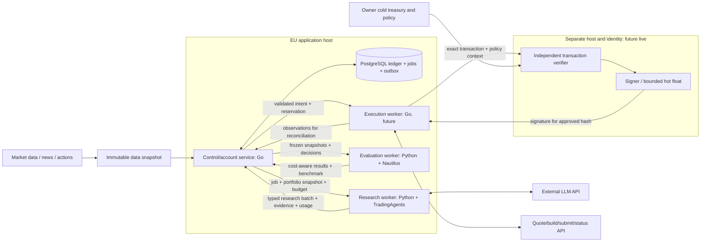

# Архитектура TradingBot: Go services и Python adapters

**Решение принято 05.10.2026.** Это целевая архитектура и порядок перехода.
Текущий runtime остаётся Python research M1; Go services, PostgreSQL jobs,
межсервисный HTTP и deployment ещё предстоит реализовать.
Правила для разработчиков: [AGENTS.md](../AGENTS.md).

## Ответственность компонентов

| Компонент | Язык | Ответственность | Runtime статус |
|---|---|---|---|
| Control/account | Go | API, scheduler, jobs/leases/outbox, snapshots, ledger, reservations, deterministic risk, costs, reconciliation | Следующий срез |
| Research worker | Python | TradingAgents graph, provider SDK/callbacks, portfolio arbitration, evidence, usage; выдаёт research batch | Сейчас CLI и library; service entry point впереди |
| Evaluation worker | Python | Nautilus replay/backtest/paper evaluation, execution-cost models, benchmarks | Сейчас synthetic native probe |
| Execution worker | Go | Allowed venue quotes/build/submit/status; без ключа и права менять policy | Будущий модуль control, затем отдельный process |
| Independent verifier/signer | Go | Decode transaction, owner limits/allowlists, approval exact hash, signing | Отдельный future live host/identity |
| PostgreSQL | SQL | Durable state/jobs/events и constraints; economic writes только через control | Не развёрнут |

Go — основной язык собственного backend. Python сохраняем для библиотек, которые
уже предоставляют graph, structured inference и evaluation engine. Обычные внешние
HTTP API доступны из Go: подключение к удалённому сервису само по себе не причина
создавать Python компонент. Языковая граница следует dependency и полномочиям.
Ускорение provider inference этой архитектурой не измерено; производительность
нашего кода проверяем профилированием и latency/cost метриками.

Сначала два service runtime: Go control и Python research. Evaluation запускается
offline по отдельному профилю и получает независимое окружение при упаковке
Nautilus. Executor становится отдельным service перед выделением его production
credentials; signer всегда отдельная signing boundary. Аналитики внутри
TradingAgents остаются частью одного upstream graph.

## Целевой поток

Control выбирает разрешённый universe и immutable state. AI определяет торговое
решение; Go проверяет его допустимость. Go kernel не подменяет стратегию набором
BUY/SELL сигналов. Python batch не является командой подписи и не переписывает
авторитетный portfolio state. Research/paper stages не подключают signer.

Research сохраняет решения без блокировки реальных средств. Paper ledger и
его reservations отделены от live account. Резервирование реальных cash/tokens
появляется только в разрешённом live протоколе и не выводится из research DTO.

## Межсервисный contract

Начинаем с HTTP/JSON и явного protocol version. Длительный LLM/backtest workflow
выполняется как job: bounded request выдаёт durable job ID, worker использует
lease/attempt/heartbeat, результат публикуется отдельно. Открытый HTTP-запрос
на всё время анализа не является механизмом очереди.

Go выдаёт portfolio snapshot, snapshot version/hash, requested symbols,
policy/config version и call/spend budget. Worker возвращает batch и provenance:
job/attempt, run ID, evidence hashes, actual usage и версии service/upstream/model.
Формат job envelope будет утверждён при реализации; существующий research DTO
содержит `run_id`, `portfolio_snapshot_id`, `as_of`, `created_at`, `expires_at`,
`evidence_hashes`, `intents` и `schema_version="0.1"`.

| Инвариант границы | Требование |
|---|---|
| Money/quantity | Decimal strings, exact arithmetic, explicit scale/rounding; raw token units integer strings |
| Schema | Strict fields/types/version; serialized schema и общие producer/consumer fixtures |
| Provenance | Snapshot/version/hash, evidence references, config/upstream/artifact versions |
| Freshness | UTC timestamps, expiry, stale portfolio refusal, quote TTL separately |
| Idempotency | Job/run/result IDs + attempt/lease + payload hash; same ID/different hash — conflict |
| Authority | Result endpoint не принимает новые balances, owner policy, credentials или signing instructions |
| Availability | Durable ACK после transaction commit; UNKNOWN execution удерживает reservation |

Текущие Python JSON amounts уже сериализуются строками. Экспортированная M1 schema
пока описывает validation inputs и допускает JSON numbers: перед Go transport
её нужно экспортировать в serialization mode и проверить boundary fixtures.
Одна schema не заменяет проверки диапазонов, precision и financial consistency.
Текущий `research` DTO не использовать для live order: live protocol и state
machine добавляются отдельным принятым изменением.

## Данные и полномочия

PostgreSQL — единый authority экономического состояния. Control владеет ledger,
reservations и account serialization. Job creation и outbox фиксируются атомарно;
worker не держит SQL transaction во время provider calls. Research работает
через control contract без прямых write credentials к balances/reservations.
Evaluation может иметь собственную область хранения результатов, с ограниченной
ролью; она не меняет реальный ledger. PostgreSQL queue достаточна для начального
объёма, отдельный broker в этой вехе не нужен.

Большие evidence/data objects хранятся как immutable files/object archive;
в SQL — hashes, timestamps, versions и ссылки. Outputs и memory lessons не
дают исполнительных полномочий. Расходы и outcomes сохраняются воспроизводимо.
Live reconciliation подтверждает реальные fills/finality по независимым
наблюдениям; timeout сам по себе не освобождает cash и не разрешает resend.

Deployment: monorepo, независимые binaries/images, приватная service network,
раздельные credentials/limits и Docker Compose на первом application host.
Signer имеет отдельный host/identity/policy, вне обычного Compose application
trust boundary. Kubernetes/service mesh не требуются текущим scale и SLA.
Эти ограничения будут проверяться acceptance tests, сейчас это проектное решение.

## Независимые обновления

TradingAgents — библиотека внутри нашего research service. Репозиторий остаётся
clean checkout, адаптер находится в `src/tradingbot/adapters/tradingagents.py`.
Service artifact фиксирует exact source SHA, Python lock hash и contract version.
Go consumer знает наш protocol; имена upstream Python functions для него закрыты.

Обновление проходит так:

1. В отдельном build окружении получить candidate release по tag и SHA.
2. Обновить только research зависимости; провести upstream adapter, producer
   и consumer compatibility tests против текущего Go artifact.
3. Выпустить immutable research image/artifact с manifest/digest. Readiness
   подтверждает конфигурацию, upstream capability и поддерживаемый protocol.
4. Остановить получение новых jobs старым worker; drain активные attempts или
   дождаться корректного lease expiry. Передать jobs новому worker.
5. Контролировать failures/usage/latency; при regression вернуть прежний artifact,
   сохранив ledger, job IDs, reservations и audit history.

Пока общий dev `uv.lock` обслуживает оба Python компонента. Для настоящей
deployment isolation research и evaluation получат свои dependency manifests,
locks и artifacts; это часть service packaging, а не уже существующая гарантия.
Go/control и execution/signer сохраняют собственные версии при обновлении TA,
если наш protocol не изменился. Breaking protocol change требует versioned
migration и совместного rollout, без ручного merge с чужими исходниками.

Рабочий updater применяется к остановленному dev/build checkout. В запущенном
сервисе не выполняются `git pull`, `uv sync` или замена `.venv`.
[Текущая процедура](upstream-updates.md) и
[план перехода](../tasks/service-migration.md) задают разные этапы.
