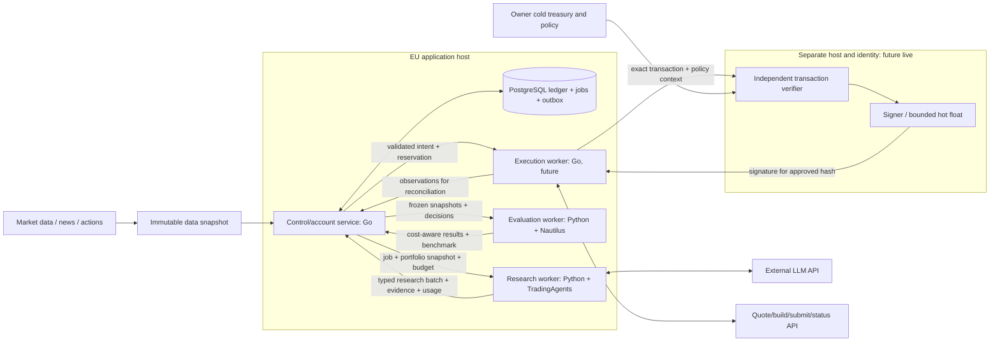

# Архитектура TradingBot: Go services и Python adapters

**Решение принято 05.10.2026.** Это целевая архитектура и порядок перехода.
Доступны Python research CLI, локальная stateless-валидация и research queue
в Go control с durable create/read, claim, heartbeat и сохранением синтетического
результата. Go fixture worker выполняет транспортный цикл задания. Python worker
запускает настоящий граф TradingAgents с локальными тестовыми моделями и получает
разрешение из общего бюджета задания перед каждым вызовом. Локальный Compose
упаковывает Go control, PostgreSQL и worker. Nautilus запускается в отдельно
закреплённом evaluation окружении. Go paper ledger ведёт виртуальные счета и
частичные и полные симулированные исполнения через локальный API.
Правила для разработчиков: [AGENTS.md](../AGENTS.md).

## Ответственность компонентов

| Компонент | Язык | Ответственность | Runtime статус |
|---|---|---|---|
| Control/account | Go | API, scheduler, jobs/leases/outbox, snapshots, ledger, reservations, deterministic risk, costs, reconciliation | `services/control/`: health, capabilities, stateless validation, PostgreSQL jobs, leases и результаты demo |
| Fixture worker | Go | Claim, heartbeat и публикация синтетического результата по выданному снимку | `services/control/cmd/research-fixture-worker`, отдельная офлайн-команда |
| Research worker | Python | TradingAgents graph, provider SDK/callbacks, portfolio arbitration, evidence, usage; выдаёт research batch | `tradingbot worker` забирает job, продлевает lease и публикует результат офлайн-графа |
| Evaluation worker | Python | Nautilus replay/backtest/paper evaluation, execution-cost models, benchmarks | `services/evaluation` с собственным lock; native probe и синтетический хронологический replay |
| Paper ledger | Go | Виртуальные деньги, позиции, резервы и журнал исполнений | `services/control/internal/ledger` с PostgreSQL, версиями состояния и историей paper fills |
| Paper application | Go | Связь операционного снимка, сохранённого исследования, политики и тестовой котировки | Локальная команда `paper-apply` сверяет полномочия и резервирует через paper ledger |
| Execution worker | Go | Allowed venue quotes/build/submit/status; без ключа и права менять policy | Будущий модуль control, затем отдельный process |
| Independent verifier/signer | Go | Decode transaction, owner limits/allowlists, approval exact hash, signing | Отдельный future live host/identity |
| Trade events | Go | Публикует события через pgqueue и Kafka | `services/trade-events/` с тестовым входом и отдельным relay для outbox paper ledger |
| Notifications | Go | Читает исполнения из Kafka, отправляет уведомления и обрабатывает аналитические команды владельца | `services/notifications/`, команды включаются при наличии URL Analytics |
| Portfolio analytics | Go | Читает события счёта и оценки из Kafka, считает NAV, P&L и доходность, предоставляет read-only API для Telegram | `services/portfolio-analytics/`, локальный paper-счёт USD. [ADR-003](decisions/003-portfolio-analytics.md) |
| PostgreSQL | SQL | Durable state/jobs/events и constraints; economic writes только через control | Локальные migrations для research snapshots/jobs/outbox, production deployment впереди |

В протоколе forward paper `paper_forward_source` фиксирует счёт, капитал,
календарь UTC, контрольные даты, источник и возраст цен, эталон и порог просадки.
После контрольной даты `forward-paper-report` повторно сверяет этот протокол
и артефакты стратегии. Выгрузки NAV, эталона и расходов получают независимые
хеши. Отчёт публикует хеш исходной регистрации и хеш протокола, производного
для конкретного периода. Эти проверки устанавливают целостность файлов.
Время регистрации и происхождение фактических наблюдений требуют отдельных
подтверждений.

Опциональный режим `require_prior_receipt` связывает контрольные даты.
Каждая квитанция хранит хеш использованного файла и хеш дневных записей
до своей даты. Следующий отчёт требует отдельно сохранённый хеш предыдущей
квитанции и проверяет старые строки. `paper-nav --verify-report` отдельно
воспроизводит NAV по закреплённым ценам и сохранённым событиям PostgreSQL.

Worker сохраняет завершение вызова отдельно от результата задания.
Каждая запись связана с уже выданным разрешением, ID попытки и сроком
аренды. PostgreSQL экспортирует все разрешения задания одним снимком
через `research-usage-export`. Отсутствующий callback виден в выгрузке и
остаётся неизвестным для оценки расходов. Точный повтор возвращает
исходную отметку записи.

Go — основной язык собственного backend. Python сохраняем для библиотек, которые
уже предоставляют graph, structured inference и evaluation engine. Обычные внешние
HTTP API доступны из Go: подключение к удалённому сервису само по себе не причина
создавать Python компонент. Языковая граница следует dependency и полномочиям.
Ускорение provider inference этой архитектурой не измерено; производительность
нашего кода проверяем профилированием и latency/cost метриками.

Сначала два service runtime: Go control и Python research. Evaluation запускается
offline по отдельному профилю и получает независимое окружение при упаковке
Nautilus. Executor становится отдельным service перед выделением его production
credentials; signer всегда отдельная signing boundary. Аналитики внутри
TradingAgents остаются частью одного upstream graph.

## Целевой поток

```mermaid
flowchart LR
    DATA[Market data / news / actions] --> SNAP[Immutable data snapshot]
    subgraph APP[EU application host]
        CTRL[Control/account service: Go]
        DB[(PostgreSQL ledger + jobs + outbox)]
        RES[Research worker: Python + TradingAgents]
        EVAL[Evaluation worker: Python + Nautilus]
        EXEC[Execution worker: Go, future]
        CTRL <--> DB
        CTRL -->|job + portfolio snapshot + budget| RES
        RES -->|typed research batch + evidence + usage| CTRL
        CTRL -->|frozen snapshots + decisions| EVAL
        EVAL -->|cost-aware results + benchmark| CTRL
        CTRL -->|validated intent + reservation| EXEC
        EXEC -->|observations for reconciliation| CTRL
    end
    SNAP --> CTRL
    RES <--> LLM[External LLM API]
    EXEC <--> VENUE[Quote/build/submit/status API]
    subgraph SIGN[Separate host and identity: future live]
        VERIFY[Independent transaction verifier]
        KEY[Signer / bounded hot float]
        VERIFY --> KEY
    end
    EXEC -->|exact transaction + policy context| VERIFY
    KEY -->|signature for approved hash| EXEC
    OWNER[Owner cold treasury and policy] --> VERIFY
```

Control выбирает разрешённый universe и immutable state. AI определяет торговое
решение; Go проверяет его допустимость. Go kernel не подменяет стратегию набором
BUY/SELL сигналов. Python batch не является командой подписи и не переписывает
авторитетный portfolio state. Research/paper stages не подключают signer.

Research сохраняет решения без блокировки реальных средств. Paper ledger и
его reservations отделены от live account. Резервирование реальных cash/tokens
появляется только в разрешённом live протоколе и не выводится из research DTO.

В локальном режиме `paper-apply snapshot` выпускает research-портфель из
версии бумажного счёта. ID снимка включает точные значения портфеля, policy
и доступные на момент снимка цены. Команда применения сверяет завершённое
задание, хеши evidence, источник результата и действующую политику владельца.
Тестовая котировка связывается с решением по идентичности инструмента и
времени после завершения research. Ledger повторно проверяет версию счёта
под блокировкой при резервировании. [Контракт команды](../contracts/paper-apply.schema.json).

`schedule-review` пишет контекст применения и задание одной транзакцией
в PostgreSQL. `paper-apply dispatch` читает завершённые записи своего
счёта и использует тот же `follow`, что доступен для отдельного задания.
Проверенная котировка фиксируется атомарно с резервом. До подтверждения
диспетчеру ledger сохраняет квитанцию, позволяющую продолжить после сбоя.
В профиле `paper` контейнер research видит только архив и HTTP Control.
После таймаута локальное наблюдение с хешем разрешает остаток исходной
виртуальной заявки. PostgreSQL проверяет идентичность котировки и сохраняет
исход наблюдения в событиях ledger.

Контрфактуальный отчёт читает сохранённый отказ симулятора и независимо
зафиксированные наблюдения входа и выхода. Метка указывает ID отмены
и горизонт. Чтение происходит в read-only режиме. История исполнений
и суммы учёта берутся из ledger.

`research-replay-export` читает исходные запросы и результаты из одного
снимка PostgreSQL. Python evaluation проверяет их хеши и сверяет время
с синтетической лентой перед передачей заявок в Nautilus. Экспорт и лента
хранятся отдельно от производного replay input для воспроизведения отчёта.
Лента `0.2` для решений с устойчивым ID фиксирует реестр владельца и
соответствие каждой бумаги отдельному ключу Nautilus. Котировки, сплиты,
дивиденды и календарь используют этот ключ на всём интервале. Прогон всегда
сверяет снимки портфеля с состоянием Nautilus. Хеш проекции research можно
независимо воспроизвести командой `verify-identity-export`.
Дневной отчёт `replay-evidence` по устойчивым ID заново строит заявки из
исходного экспорта, ленты и реестра. Протокол закрепляет хеши этих входов,
предел давности котировок и `security_id` отдельных эталонов. Для стратегии
и эталонов применяются одни и те же отсечки UTC и условия синтетической ленты.
В строгом режиме Nautilus восстанавливает счёт от выделенного cash к
каждому снимку и сверяет позиции и балансы. Прогон прерывается, если
заявка использует снимок, устаревший до исполнения. Это проверка
предоставленной синтетической выборки.
Происхождение и полнота рыночных данных проверяются отдельно.

`walk-forward` на каждом срезе восстанавливает портфель из предшествующих
виртуальных исполнений. Evaluation передаёт его отдельному локальному
процессу `historical-step` через JSON. Research проверяет хеш архива,
фильтрует записи по локальному времени получения и выполняет закреплённый
офлайн-граф с лимитом вызовов. Момент завершения берётся из синтетического
плана. В отчёте он не является квитанцией PostgreSQL или измеренной
задержкой провайдера.
План и лента `0.2` добавляют пин реестра и устойчивые ID. Evaluation
восстанавливает точный инструмент по ключу Nautilus, а отдельный процесс
research независимо сверяет архив и реестр. Каждый шаг проверяет непрерывность
снимков. Финальная оценка требует допущенного инструмента и видимой котировки.

Для дневного отчёта протокол `walk_forward_source` фиксирует входной план
и ленту. Прогон формирует шаги анализа из этих входов, а NAV повторно
рассчитывается нативным движком к концу каждого дня. Сводка проверяет
связь отчёта с протоколом и хранит хеш шагов. Проверка происхождения
выполняется повторным прогоном на исходных файлах. Бумажный NAV допускает
отдельный хешированный ряд синтетического индекса полной доходности.
Для сравнения вариантов `ablation-evidence` закрепляет общий реестр,
исходные файлы, даты и совокупный бюджет. Хеш реестра сохраняется в
квитанции каждого варианта вместе с хешами шагов и конфигураций.

`schedule-entry` использует выданный Control снимок и хеш локального
результата отбора. Допущенный вход использует то же атомарное сохранение
задания и контекста применения, что пересмотр позиции. Фиксация forward
эксперимента связывает файлы конфигурации с составом стратегий и протоколом
оценки. [Команды запуска](../README.md#виртуальный-paper-счёт).

Локальный процесс `entry_cycles` обрабатывает хешированный план и сохраняет
входы Go в журнале до отправки. Профиль `paper-entry` монтирует архив для
чтения и сохраняет журнал в отдельном томе. Очередь обслуживает research
worker через Control. Профиль `paper-quote` читает хешированную синтетическую
ленту счёта и сохраняет закреплённые котировки для завершённых заданий.
Диспетчер читает ту же директорию. После смены политики продолжение
зарезервированного ордера сверяет исходное применение и закреплённую
котировку с ledger. Для нового резерва требуется действующая политика.

Вход с устойчивым ID использует расписание `0.2`. Go проверяет активный
реестр владельца и сопоставляет `security_id` с точным инструментом
в политике и снимке. PostgreSQL принимает задание и запись диспетчера
одновременно. Запись фиксирует хеш конфигурации отбора, хеш проекции,
архив котировок, упорядоченные привязки и срок их действия. Перед новым
резервом диспетчер сверяет результат исследования, текущие пины
и точные байты firm-котировки
из ленты `0.3`. Срок резерва ограничен первым истекающим входом. После
сбоя диспетчер продолжает сохранённую заявку с её исходной котировкой.

Планировщик пересмотра берёт факт открытия и актуальный снимок из ledger.
При наступившем сроке или архивном катализаторе он создаёт research job с
устойчивым ID триггера. Пересмотр `0.2` проверяет исходное применение,
котировку и квитанцию из PostgreSQL. Независимо подготовленный снимок,
его проекция и текущий реестр владельца фиксируются в задании. Если реестр
обновился, исходный `security_id` и точный инструмент должны по-прежнему
соответствовать открытой позиции. Катализатор бумаги должен ссылаться на
тот же ID у разрешённого провайдера или на сопоставленный SEC CIK.
В исходах `paper-memory` для следующего research
остаются только сверенные FIFO-исполнения, записанные к cutoff. Источник и
комиссии передаются вместе с исходом. [Порядок запуска](../README.md#виртуальный-paper-счёт).

В профиле `paper-review-cycles` локальный оркестратор получает снимок на
каждое окно хешированного плана и фиксирует собранный запрос в отдельном
томе журнала. Go отслеживает принятый триггер в PostgreSQL. Повтор после
сбоя использует сохранённые байты, а более поздний срез уже обработанного
триггера получает исходный job ID. Записи плана ссылаются на локальные цены
и архивные события, доступные к моменту снимка.

Отчёт об исходе тезиса `0.2` сверяет привязку каждой отнесённой FIFO-продажи
с исходной покупкой. Для оценки открытого остатка выбирается подходящее
firm-наблюдение на полном объёме из закреплённой ленты `0.3` исходного счёта.
Закреплённый реестр ленты должен допускать тот же инструмент на момент оценки.
Хеши открытия, исполнений, реестра и выбранной котировки позволяют
воспроизвести расчёт. При отсутствующем наблюдении оценка остатка неизвестна.

Журнал уроков хранит точный исход виртуального SELL и смену статуса отдельными
событиями. Экспорт `paper-memory --durable-lessons` читает FIFO и активную
ревизию из одного снимка PostgreSQL. Python сверяет источник и момент
доступности. Исторический `factual_reflection` использует сохранённый вывод
на срезе экспорта. Research `0.2` включает такие выводы только для той же
бумаги и точного инструмента. Для выводов используется активная durable
ревизия к моменту решения.

## Межсервисный contract

Начинаем с HTTP/JSON и явного protocol version. Длительный LLM/backtest workflow
выполняется как job: bounded request выдаёт durable job ID, worker использует
lease/attempt/heartbeat, результат публикуется отдельно. Открытый HTTP-запрос
на всё время анализа не является механизмом очереди.

Job envelope `0.1` для create/read содержит immutable research portfolio,
ссылку и хеш data manifest, requested symbols, policy version и call budget.
Control возвращает durable ACK после commit snapshot, job и creation outbox.
PostgreSQL выдаёт и продлевает один действующий lease на job по своему времени.
Попытку идентифицируют worker ID, claim ID, номер и уникальный token.
Повтор того же claim в пределах lease возвращает уже выданную попытку.
Completion принимает метаданные `synthetic_fixture` в контракте `0.1` и
`tradingagents_offline` в `0.2`. В `0.2` Go связывает результат с попыткой,
исходным манифестом, политикой и лимитом вызовов из сохранённой job. Версии,
SHA upstream, хеш конфигурации и учёт вызовов публикует Python worker.
Go fixture worker публикует без обращения к моделям, используя только выданный
snapshot и universe. При потере ответа он повторяет тот же claim ID или payload
completion. Control сравнивает batch с сохранённым snapshot и universe, пересчитывает
evidence hashes из текста и проверяет lease перед записью. Результат, статус
и outbox commit атомарно. Для тестовых моделей USD billing неизвестен.
Для локального PIT-архива worker сверяет хеш и доступность каждой записи
и её локальное получение к моменту снимка. Архивная диагностика позволяет
отдельно воспроизвести срез по времени публикации источника. Research DTO
содержит `run_id`, `portfolio_snapshot_id`, `as_of`, `created_at`, `expires_at`,
`evidence_hashes`, `intents` и `schema_version="0.1"`.

Job envelope `0.2` сохраняет ссылку на реестр владельца и упорядоченную
привязку запрошенных тикеров к `security_id`. Control принимает новый
контракт при включённом пине SHA-256. Транзакция аренды выбирает задания
конкретного реестра и сохраняет пин вместе с ID попытки. Для старых
заданий используется пустой пин. Архивный worker сверяет точную ссылку
и хеш отдельно от задания, проверяет доступный листинг и передаёт
в TradingAgents срез выбранной бумаги. Результат `0.3` содержит исходные
привязки и SHA-256 проекции. Control сверяет привязки с исходным заданием.
Выгрузка хранит точные байты запроса и результата для воспроизведения среза.

Для каждого модельного вызова Go проверяет действующий lease и резервирует один
слот из `max_llm_calls` в PostgreSQL. Новый вызов допускается после подтверждения
записи. `call_id` делает повтор запроса идемпотентным. Потерянная квитанция,
прерывание модели и истечение lease сохраняют расход слота. Новая попытка
вычитает все разрешения задания. Go проверяет число разрешений попытки и число
вызовов в результате `0.2` под той же блокировкой задания. Миграция считает
неучтённый расход прежних активных попыток неизвестным и блокирует новые
разрешения по таким заданиям. Ранее записанные результаты доступны и допускают
идемпотентное чтение через прежний протокол.

Добровольно активируемый суточный лимит относится ко всей research
очереди. Выдача разрешения и активация используют одну блокировку в
PostgreSQL. Выданные до активации разрешения входят в расход тех же суток
UTC. После первой даты из политики сутки без лимита блокируют новые
разрешения, а запрос с прежним ID возвращает исходную квитанцию.

| Инвариант границы | Требование |
|---|---|
| Money/quantity | Decimal strings, exact arithmetic, explicit scale/rounding; raw token units integer strings |
| Schema | Strict fields/types/version; serialized schema и общие producer/consumer fixtures |
| Provenance | Snapshot/version/hash, evidence references, config/upstream/artifact versions |
| Freshness | UTC timestamps, expiry, stale portfolio refusal, quote TTL separately |
| Idempotency | Job/run/result IDs + attempt/lease + payload hash; same ID/different hash — conflict |
| Authority | Result endpoint не принимает новые balances, owner policy, credentials или signing instructions |
| Availability | Durable ACK после transaction commit; UNKNOWN execution удерживает reservation |

Research DTO описан [общими JSON Schema и fixtures](../contracts/).
Python сериализует amounts десятичными строками. Go проверяет схему,
freshness и согласованность распределения с переданным portfolio и universe.
И диагностика, и локальное создание job получают research portfolio от
вызывающей стороны. Сохранённая запись фиксирует этот ввод. Control проверяет
сохранённые хеши перед выдачей и проверяет attempt и snapshot при записи результата.
Доступность содержимого data manifest проверяется при интеграции с архивом.
Право на paper/live execution задаётся отдельными протоколами.

## Данные и полномочия

PostgreSQL — единый authority экономического состояния. Control владеет ledger,
reservations и account serialization. Job creation и outbox фиксируются атомарно;
worker не держит SQL transaction во время provider calls. Research работает
через control contract без прямых write credentials к balances/reservations.
Evaluation может иметь собственную область хранения результатов, с ограниченной
ролью; она не меняет реальный ledger. Research jobs используют PostgreSQL.
Kafka используется для событий об исполненных сделках по [ADR-002](decisions/002-trade-notifications.md).
`trade-events` владеет outbox и соединением с PostgreSQL. `notifications`
имеет доступ к Kafka и Telegram. Сервисы собираются из отдельных Go-модулей,
обмениваются событиями по версионированному JSON-контракту и разворачиваются
через [Compose](../deploy/notifications/compose.yaml).

Большие evidence/data objects хранятся как immutable files/object archive;
в SQL — hashes, timestamps, versions и ссылки. Outputs и memory lessons не
дают исполнительных полномочий. Расходы и outcomes сохраняются воспроизводимо.
Live reconciliation подтверждает реальные fills/finality по независимым
наблюдениям; timeout сам по себе не освобождает cash и не разрешает resend.

Deployment: monorepo, независимые binaries/images, приватная service network,
раздельные credentials/limits и Docker Compose на первом application host.
Signer имеет отдельный host/identity/policy, вне обычного Compose application
trust boundary. Kubernetes/service mesh не требуются текущим scale и SLA.
Эти ограничения будут проверяться acceptance tests, сейчас это проектное решение.

## Независимые обновления

TradingAgents — библиотека внутри нашего research service. Репозиторий остаётся
clean checkout, адаптер находится в `services/research/tradingbot/adapters/tradingagents.py`.
Service artifact фиксирует exact source SHA, Python lock hash и contract version.
Go consumer знает наш protocol; имена upstream Python functions для него закрыты.

Обновление проходит так:

1. В отдельном build окружении получить candidate release по tag и SHA.
2. Обновить только research зависимости; провести upstream adapter, producer
   и consumer compatibility tests против текущего Go artifact.
3. Выпустить immutable research image/artifact с manifest/digest. Readiness
   подтверждает конфигурацию, upstream capability и поддерживаемый protocol.
4. Остановить получение новых jobs старым worker; drain активные attempts или
   дождаться корректного lease expiry. Передать jobs новому worker.
5. Контролировать failures/usage/latency; при regression вернуть прежний artifact,
   сохранив ledger, job IDs, reservations и audit history.

Пока общий dev `uv.lock` обслуживает оба Python компонента. Для настоящей
deployment isolation research и evaluation получат свои dependency manifests,
locks и artifacts; это часть service packaging, а не уже существующая гарантия.
Go/control и execution/signer сохраняют собственные версии при обновлении TA,
если наш protocol не изменился. Breaking protocol change требует versioned
migration и совместного rollout, без ручного merge с чужими исходниками.

Рабочий updater применяется к остановленному dev/build checkout. В запущенном
сервисе не выполняются `git pull`, `uv sync` или замена `.venv`.
[Текущая процедура](upstream-updates.md) и
[план перехода](planning/service-migration.md) задают разные этапы.
