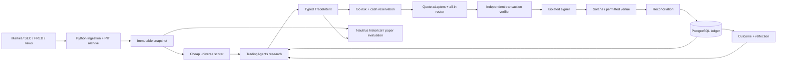

# Автономный AI equity trader: исследование и план реализации

**Срез исследования: 4 октября 2026 года. Статус исходного документа: проектирование. Теперь начата первая research implementation; см. [Milestone 1](../docs/implementation-m1.md). Live-сделки не отправлялись.** Основной сценарий по уточнению владельца: европейский розничный пользователь, европейское резидентство и инфраструктура в ЕС. Конкретная страна, налоговый режим и подтверждённая категория клиента неизвестны. Сценарий с паспортом Беларуси сохранён отдельно в §16. Все суммы — USD, если не указано иное.

Обозначения: **проверено** — исходный код или первичный источник; **заявлено автором** — результат публикации/README без независимого воспроизведения; **проектное решение** — предложение для нашей системы; **UNKNOWN** — данных для вывода нет. Дата проверки всех ссылок — 04.10.2026; версии и доказательства перечислены в [реестре источников](../research/SOURCES.md). Наличие документации не подтверждает доступ конкретного пользователя к продукту.

## 1. Executive Summary

**START WITH CONDITIONS — начать исследование и forward paper, не начинать автономную live-торговлю сейчас.** На сегодня нет доказанного net risk-adjusted alpha этой системы, подтверждённого retail-доступа к выбранному RFQ и измеренных исполнимых котировок для $1 000. На таком капитале регулярные расходы могут быть сильнее потенциального торгового преимущества.

Форкнуть **TauricResearch/TradingAgents v0.6.0**, зафиксировав commit `1394a3f72aa4393e1a98f51b382434c4b4c2d972`, как исследовательский AI workflow. Подключить существующий **NautilusTrader BacktestEngine**, а не писать новый симулятор. Python отвечает за исследования и решения; отдельный Go-сервис — за risk checks, котировки, исполнение и reconciliation; PostgreSQL — за портфель, события, задания и воспроизводимую память. Сырые данные — immutable Parquet/JSON-файлы с хешами и резервной копией. Один EU VPS для research/control и отдельный изолированный signer для live. Docker Compose; без Kafka, Redis, Kubernetes и векторной БД в MVP.

Первый execution-кандидат для self-custody — **одна сеть Solana, USDC, разрешённые xStocks, Jupiter Swap v2**; xChange и Ondo подключаются только после подтверждения доступа, minimum size и фактической экономики. Это кандидат для эксперимента, не доказанный лучший маршрут. Обычный брокер — полноценная альтернатива и контрольный execution baseline; если он дешевле и tokenization не даёт измеримой выгоды, выбирать брокера.

Для $1 000 исследовательский lean-режим ориентировочно стоит **$35–100/месяц**, полноценный режим с платными данными может стоить **$100–400+**; это плановые бюджеты, не тарифные предложения. Даже $60/месяц требуют 72% годового простого excess return только для покрытия фиксированных расходов. Поэтому $1 000 — бюджет проверки технологии с заранее ограниченным убытком; экономически жизнеспособный капитал пока UNKNOWN. Доходность не прогнозируется.

Первая задача — **P0-01: подтвердить eligibility и API-доступ для конкретной страны/категории клиента и получить условия исполнения**. Первая задача разработки после этого — **P1-01: воспроизводимый TradingAgents baseline на зафиксированном commit без подключения кошелька**. Полный [backlog](todo.md).

## 2. Current State of the Ecosystem — October 2026

TradingAgents существенно изменился: v0.6.0 опубликован 03.10.2026 21:30 UTC, то есть уже 04.10 по Москве. Есть parallel analysts, typed research/trader/portfolio outputs, portfolio context, checkpointing, две LLM tiers и файловая settled memory. Строить план по старой версии с обязательной Chroma/BM25-памятью неверно. [Release](https://github.com/TauricResearch/TradingAgents/releases/tag/v0.6.0).

GitHub snapshot: TradingAgents — 109 755 stars, 21 096 forks; FinRL — 16 550/3 537; FinRL-X — 3 780/1 107; AI Hedge Fund — 63 857/11 223; FinMem — 962/195; FinAgent — 75/27; ATLAS — 2 307/416. Это популярность и поверхность сопровождения, не доказательства alpha. API snapshot сохранён локально; показатели меняются.

В экосистеме есть рабочие research workflows, paper ledgers и execution SDK, но связка «LLM → автономные сделки → независимая положительная alpha после LLM/data/chain costs» не подтверждена найденными материалами. Onchain secondary trading доступен вне биржевых часов, но доступность ликвидности, прямого mint/redeem и референсной цены — разные свойства.

Новые релевантные проекты: FinWorld — research benchmark; OpenAlice — AGPL trading framework; Predict/Raven — публичные ops/forward-paper практики, преимущественно prediction markets. Ни один не принят как доказанно лучший equity core. У Raven README live Polymarket operation приостановлена с июня, последующий paper/stock-shadow не означает verified live equity alpha. Использовать новые проекты только после воспроизводимого сравнения, а не по обещаниям README. [FinWorld](https://github.com/DVampire/FinWorld), [OpenAlice](https://github.com/TraderAlice/OpenAlice), [Raven](https://github.com/Alchemist-X/predict-raven).

## 3. Recommended Existing Open-Source Core

Выбор TradingAgents **условный**: минимальный путь к проверке идеи, Apache-2.0, активное сопровождение, уже имеющиеся debate/portfolio/memory механизмы. Это AI research core, не OMS, risk kernel или готовый автономный брокер.

| Проверенный компонент | Что действительно делает | Что требуется нам |
|---|---|---|
| `graph/setup.py`, `analyst_execution.py` | Параллельные аналитики с отдельными message state; затем debate/manager/trader/risk/PM | Сохранить workflow, добавить общий as-of и immutable входы |
| `agents/schemas.py` | Typed research plan, trader proposal, PM rating | Новый строго проверяемый TradeIntent; sizing/horizon upstream частично свободный текст |
| `portfolio.py` | Cash, currency, ticker, quantity, average price | Marks, exposure, reserved cash, pending orders, issuer/sector/correlation |
| `memory/log.py` | Markdown memory, file locks, date-filtered settled context | SQL identifiers, multiple intraday decisions, available_at, immutable events |
| `memory/settlement.py`, `reflection.py` | Доходность underlying через фиксированное окно, benchmark excess и reflection | Реальный fill/cashflow P&L, разные горизонты, закрытые позиции и shadow outcomes |
| `backtest.py` | Ticker/date runs и rating scoring, один portfolio snapshot | Хронологический portfolio simulation с cash, orders, fills и затратами |
| `cli/stats_handler.py` | LLM/tool counts и агрегированный token usage | Стоимость по модели, cache, retries, reasoning, rate snapshot, spend caps |

Доказательства: [schemas](https://github.com/TauricResearch/TradingAgents/blob/1394a3f72aa4393e1a98f51b382434c4b4c2d972/tradingagents/agents/schemas.py), [portfolio](https://github.com/TauricResearch/TradingAgents/blob/1394a3f72aa4393e1a98f51b382434c4b4c2d972/tradingagents/portfolio.py), [backtest](https://github.com/TauricResearch/TradingAgents/blob/1394a3f72aa4393e1a98f51b382434c4b4c2d972/tradingagents/backtest.py), [memory](https://github.com/TauricResearch/TradingAgents/blob/1394a3f72aa4393e1a98f51b382434c4b4c2d972/tradingagents/memory/log.py).

Критические ограничения source review:

- `propagate(ticker, YYYY-MM-DD)` не является intraday as-of API. Все источники должны быть переданы через наш timestamped snapshot, иначе новости сегодняшнего вечера попадут в утреннее решение.
- SEC facts фильтруются по `filed`-дате; это недостаточно для intraday acceptance time. Yahoo `auto_adjust=True` может переписать прошлые абсолютные цены после будущих corporate actions. FRED vintage date полезен, но release time тоже нужен.
- PM имеет fallback к свободному тексту. Для research допустимо; execution adapter обязан отвергать отсутствие валидного typed intent.
- Backtest идёт ticker-first/date-second и не ведёт эволюцию капиталов нескольких бумаг. Его «alpha» — score/return difference, не наша итоговая net portfolio alpha.
- Reflection фиксированного окна — не outcome реальной многомесячной позиции. Markdown settlement переписывает запись; «append-only» не означает защищённый immutable audit log.
- Average entry и формулировки take partial profits могут усиливать anchoring. Для торгового решения использовать forward expected utility; basis держать в отдельном P&L/tax контексте.

Открытые issues/PR учитываются как сигналы, не как установленные дефекты нашей версии: [#805 temporal leakage](https://github.com/TauricResearch/TradingAgents/issues/805), [#1374 historical valuation](https://github.com/TauricResearch/TradingAgents/issues/1374), [#1390 typed compatibility](https://github.com/TauricResearch/TradingAgents/issues/1390), [#1479 memory rotation/backtest retention](https://github.com/TauricResearch/TradingAgents/pull/1479). Последний на срезе не принят; baseline не должен удалять settled history. Просмотрено 84 top-level test modules; тесты upstream в рамках исследования не запускались. Концентрация contributions у основного maintainer — bus-factor риск.

Upstream disposition: **KEEP** graph/analysts/debate/provider abstraction/typed helpers; **MODIFY** prompts, portfolio context, intraday input boundary, memory retrieval и billing; **REPLACE** rating-only evaluation как главный backtest и Markdown как authoritative ledger; **REMOVE из live path** free-text execution fallback, uncontrolled vendor lookups, default fixed 5-day outcome label и необязательные social/debate rounds до ablation. Сам core не переписывать.

GitHub API snapshot показывает 35 open issues и 42 open PR на срезе (77 combined); 23 видимых contributors, у основного автора 420 contributions в возвращённом API наборе. Это свидетельство activity и maintainer concentration, не число production deployments. Fork TradingAgents-CN активен, но licensing/data-market focus не делают его автоматически лучшим EU equity core. Commit/release activity и счётчики сохранены в research JSON, не extrapolate uptime.

## 4. Comparison with Alternatives

| Проект / pinned snapshot | Сильная сторона | Ограничение source review | Решение |
|---|---|---|---|
| TradingAgents / `1394a3f` | Debate, portfolio context, современная память, Apache-2.0 | Не portfolio execution simulator; intraday/PIT/sizing доработать | Основной research fork |
| FinAgent / `17248a0` | Intelligence + high/low-level reflection, MIT | Runtime старый; state содержит look-forward slice: train/eval границу надо трассировать; FAISS exceptions скрываются | Повторить идеи в ablation, не переносить runtime |
| FinMem / `be814aa` | Recency/importance/relevance, memory layers, MIT | Старый runtime, embedding cost, pickle persistence | Опциональный memory baseline после простой SQL-памяти |
| FinRL-X / `4409abe` | Selection/allocation/timing/risk, bt, Alpaca, Apache-2.0 | Quarter-date map не фактическое filing time; current S&P universe в screener | Baseline/идеи, не готовый PIT evaluator |
| FinRL | RL environments и исследования, MIT | Дополнительный training/data burden, alpha не доказана для задачи | Не MVP |
| AI Hedge Fund / `78b779c` | Paper execution, ledger, portfolio/risk, MIT | README educational; paper approval не autonomous live | Сравнить ledger/reconciliation patterns |
| ATLAS / `cf4349f` | Regime/regret/reflection concepts | MIT для architecture/examples; production prompts proprietary и отсутствуют | Не reproducible core |
| TradingAgents-CN | Большое сообщество, локальные интеграции | Гибридная лицензия: нельзя считать весь application Apache | Не форкать целиком |
| FinWorld / Qlib | Benchmark/data workflows / deterministic feature workflows | Не готовый self-custody trader | Qlib optional scorer; FinWorld research comparison |

Источники: [FinAgent](https://github.com/DVampire/FinAgent/tree/17248a0b8b729ee3e093e30bb7bea7f52181f363), [FinMem](https://github.com/pipiku915/FinMem-LLM-StockTrading/tree/be814aa47970de9bf2fdd6a1d5a60ae5cf361b46), [FinRL-X](https://github.com/AI4Finance-Foundation/FinRL-Trading/tree/4409abe925c904e570be78ebfb5e77ac3491dff8), [AI Hedge Fund](https://github.com/virattt/ai-hedge-fund/tree/78b779c1389e2d1452dc29606d2c4126d859b964), [ATLAS license](https://github.com/chrisworsey55/atlas-gic/blob/cf4349f15c9d68a67042f792973372f2e0231088/LICENSE), [Qlib](https://github.com/microsoft/qlib).

Публичные результаты нельзя объединять в один рейтинг:

| Evidence tier | Результат из первичного материала | Ограничение |
|---|---|---|
| TradingAgents, author backtest, paper v1 | AAPL 26.62% vs B&H −5.23%; GOOGL 24.36% vs 7.78%; AMZN 23.21% vs 17.10%; Sharpe 8.21/6.39/5.60; MDD 0.91/1.69/2.11% | Paper одновременно описывает разные периоды; не аудированная live alpha; полные расходы/число сделок не установлены |
| FinAgent, author backtest, paper v2 | TSLA **annualized** return 92.27% vs B&H 37.40%, Sharpe 2.01, MDD 12.14%; test 01.06.2023–01.01.2024 | ARR не total return; config fee 10 bps не включает полный OPEX; model leakage не исключён |
| FinMem в таблице FinAgent | TSLA ARR 50.04%, Sharpe 0.92, MDD 25.77% | Сравнение другим автором, не независимый audited track record |
| FinRL-X, author paper record | Oct 2025–Mar 2026 +19.76%, SPY −2.51%, QQQ −4.79%, Sharpe 1.96, MDD 12.22% | Заявлено в README, не наш replay/аудит, не доказан учёт всех расходов |
| ATLAS | Автор заявляет +22% за 173 deployment days | Benchmark, полные расходы и независимая верификация UNKNOWN |
| Наш независимый backtest / forward paper / live | **UNKNOWN / отсутствует / отсутствует** | Это следующие экспериментальные стадии |

Источники: [TradingAgents paper v1](https://arxiv.org/html/2412.20138v1), [FinAgent paper v2](https://arxiv.org/html/2402.18485v2), [FinRL-X README](https://github.com/AI4Finance-Foundation/FinRL-Trading), [ATLAS](https://github.com/chrisworsey55/atlas-gic). Excess в этих таблицах — арифметическая разница доходностей, не автоматически факторная alpha. Ни один показатель не является прогнозом нашей доходности. Для paper v1 вывод относится именно к прочитанной версии, не к любой последующей редакции.

Дополнительные границы empirical evidence:

| Result | Period / sample | Excess return и cost evidence | Missing fields |
|---|---|---|---|
| TradingAgents v1 | 3 stocks; simulation section 19.06–19.11.2024, data section Jan–Mar2024 и prose «<3 months» конфликтуют | AAPL +31.85pp, GOOGL +16.58pp, AMZN +6.11pp относительно авторского B&H; полный all-in cost UNKNOWN | Trade count, independent reproduction, audited NAV; exact common evaluation period unresolved |
| FinAgent TSLA v2 | 01.06.2023–01.01.2024; 1 приведённая акция, paper suite 5 stocks+ETH | ARR difference +54.87pp **annualized**, не total-period alpha; checked TSLA config transaction_cost_pct=0.001 | Total-period return, executed trade count, LLM/data/OPEX; independent live alpha |
| FinMem TSLA в FinAgent | Та же comparative table/sample design автора FinAgent | ARR difference +12.64pp; cost comparability needs full trace | Total return, trade count, our net cost replication |
| FinRL-X paper claim | Oct2025–Mar2026, 6 months; strategy NAV | Excess SPY +22.27pp / QQQ +24.55pp; complete all-cost accounting UNKNOWN | Trade count, audited fills, LLM applicability, independent verification |
| ATLAS deployment claim | 173 days; exact calendar range UNKNOWN | Return +22%; benchmark/excess/SR/MDD/costs UNKNOWN для этого deployment claim | Trade count, audited account, reproduction without proprietary prompts |
| Our system | No sample yet | All returns/alpha/SR/MDD UNKNOWN | Backtest/paper/live/audit all pending |

Sources — те же pinned papers/README предыдущей таблицы; различие ARR/total return и несовпадение periods не исправлять догадкой. FinMem own paper рассмотрен как другой author result, не смешан с comparative FinAgent numbers.

## 5. What We Reuse vs What We Build

| Reuse | Build / adapt | Причина |
|---|---|---|
| TradingAgents agents/graph/provider abstraction/typed helpers | Snapshot tools, intent contract, portfolio allocator, cost-aware prompts | Не создавать второй debate framework |
| Nautilus event loop, orders, fills, portfolio reports | Wrapper instruments, quote replay, provider fee/fill models, action feed | Существующий engine; ограниченные domain adapters |
| PostgreSQL transactions/jobs/constraints | Schema, outbox, reservations, immutable event ledger, memory views | Один authoritative ledger |
| SEC/FRED vendor adapters | Acceptance/vintage timestamps, archive, corporate actions | PIT correctness |
| Jupiter/xChange/Ondo SDK/OpenAPI/proto; maintained Solana Go SDK | Route normalization, transaction policy, reconciliation | Не писать криптографию или DEX |
| Existing logging/metrics libraries | Business metrics, billing, alerts, replay reports | Проверяемая эксплуатация |

Не писать собственные AMM, smart contracts, backtesting engine, execution cryptography, universal agent platform. Расширения upstream держать маленькими; наш portfolio/execution contract — вне fork. Лицензии Nautilus LGPL-3.0 и выбранных библиотек проверить для способа распространения. [NautilusTrader](https://github.com/nautechsystems/nautilus_trader).

## 6. Target Architecture



На research/paper стадии signer отсутствует, Go executor работает с simulated venue. В live Python не знает private key, не имеет broker execution credentials или KMS Sign permission. Go не получает право администрировать signer. Read-only chain reconciliation использует независимый RPC и связывает события с intent/quote/signature IDs.

Postgres: `assets`, `asset_versions`, `raw_objects`, `observations`, `snapshots`, `decision_runs`, `intents`, `quotes`, `orders`, `fills`, `cashflows`, `positions`, `reservations`, `ledger_events`, `outcomes`, `lessons`, `llm_usage`, `jobs`, `outbox`, `config_versions`. Один writer на account allocation; SQL transactions и unique idempotency keys. Файлы больших входов вне SQL; хеш/URI/version внутри SQL. Outbox не заменяет финальность blockchain.

## 7. AI Agent Architecture

Сохраняем четыре upstream analysts: market/technical, news, fundamentals, social; social выключен по умолчанию, пока качество/цена не доказаны. Macro/regime — общий snapshot и отдельный дешёвый cache, не новый агент на каждую бумагу. Bull/bear debate → research manager → trader proposal → три risk perspectives → portfolio manager. Сначала один debate round; второй только как зарегистрированная ablation.

AI определяет thesis, BUY/SELL/HOLD/ADD/REDUCE, целевой размер, горизонт, вероятность сценариев и необходимость следующего review. Детерминированный kernel ограничивает опасные действия, но не генерирует торговые сигналы. Probability/expected return — оценка модели, а не достоверная статистика: требуются calibration, Brier/log loss, интервалы и abstain.

Роли и бюджет одного вызова ниже — **сценарные token allocations**, не измеренный usage. Quick = Haiku 4.5 price basis, deep = Sonnet 5 price basis из §24; конкретные supported IDs и EU routing подтвердить P1. Cost уже включает output; tool loops/retries сверх таблицы.

| Role | Зачем / input → output | Tier, input/output tokens, cost | Parallel / possible replacement |
|---|---|---|---|
| Market/technical | Raw bars, indicators, liquidity → trend/risks/evidence | Quick, 8k/1k, $0.013 | Parallel с другими analysts; deterministic features, interpretation ablation |
| Fundamental | PIT filings/facts/actions → valuation/scenarios/missing data | Quick, 8k/1k, $0.013 | Parallel; ratios deterministic, qualitative thesis AI |
| News | Timestamped licensed/issuer news → catalysts/impact | Quick, 8k/1k, $0.013 | Parallel; classification/extraction cheaper model candidate |
| Sentiment/social | Qualified source snapshot → sentiment/uncertainty | Quick, 8k/1k, $0.013 | Parallel; default OFF, replace/drop if no incremental benefit |
| Macro/regime | Vintage macro + market regime → shared context | Quick optional 2k/0.2k, $0.003 | Один shared update, не per ticker; deterministic regime baseline |
| Bull researcher | Analyst reports → upside thesis/probability/evidence | Quick, 5k/0.5k, $0.0075 | Debate sequential; compare independent branches in ablation |
| Bear researcher | Reports + bull thesis → downside/challenge | Quick, 5k/0.5k, $0.0075 | Sequential upstream; drop debate in single-agent baseline |
| Research manager | Debate + reports → strategic plan | Deep, 8k/1k, $0.026 | После debate; cheaper tier ablation |
| Trader | Plan + portfolio/costs → action/target/horizon proposal | Quick, 8k/1k, $0.013 | После plan; AI remains decision owner |
| Three risk perspectives | Proposal/scenarios/exposure → critiques | Quick each 3k/0.5k, $0.0055 each | Sequential upstream; deterministic limits separate, 1-agent/no-agent ablation |
| Portfolio manager | Proposals/critiques/global cash/exposures → final typed intent batch | Deep, 12k/2k, $0.044 | One account arbiter; no parallel spending of same cash |
| Reflection | Mature actual/counterfactual outcome → sourced lesson | Quick, 2k/0.3k, $0.0035 | Background after outcome, no latency-critical path; no-reflection baseline |

Первые 12 workflow calls суммарно ~$0.1665 в этой allocation без macro/reflection; §24 округляет до $0.17 и закладывает overhead. Если social выключен, cost меньше. Эта таблица не является требованием использовать все роли: сохранение role зависит от ablation net benefit. LLM inference не в millisecond execution path.

Контракт `TradeIntent`:

| Поле | Требование |
|---|---|
| IDs/version/as_of/expires_at | Уникальность, model/prompt/data/config hashes |
| action / underlying / existing instrument | BUY, SELL, HOLD, ADD, REDUCE; для SELL точный held token |
| desired target / delta / currency | Decimal; quantity и notional не противоречат друг другу |
| horizon / review trigger | Часы–месяцы; next_review_at, catalyst, invalidation |
| scenario distribution | Probabilities sum 1, downside/upside cases, uncertainty |
| expected forward net return | После marginal execution/holding cost; benchmark opportunity cost |
| cost cap / limit / slippage / valid session | Конкретные границы, не строка «small position» |
| evidence / missing data / thesis | Source IDs и available_at; no fabricated references |
| portfolio snapshot version | Reject stale intent, re-evaluate при изменении cash/positions |

PM агрегирует конкурирующие proposals одним portfolio batch. Нельзя разрешать пяти single-ticker graphs потратить один и тот же cash. Изменение target после risk rejection требует нового AI решения или явно разрешённого monotone clipping с записью причины; kernel не переворачивает BUY в SELL.

## 8. Memory & Reflection Architecture

Начать с upstream file memory как baseline; target — SQL event memory, без vector database. Разделить: факт решения; факт исполнения; portfolio cashflows; outcome; авторскую lesson. Reflection никогда не меняет исходный intent или fill.

Retrieval сначала ticker/sector/regime/action/horizon + time filter, затем latest/top relevant ограниченный контекст. Recency-weighted и FinMem-style semantic retrieval — только ablations. Каждая lesson имеет `created_at`, `available_at`, observation end, source decision IDs, confidence, applicable regime, decay/version. В backtest lesson доступна лишь после её действительного создания и наступления label; future winner/loser недоступен даже при ранней дате решения.

Позицию нельзя объявлять ошибкой только из-за краткосрочного убытка при многомесячном thesis. Outcome: realized net P&L при закрытии, horizon mark-to-market для незакрытых, benchmark-relative return, calibration, adverse/favorable excursion, execution quality. Отдельно стратегия, execution failure и luck. Shadow rejected intents — counterfactual, не реальные прибыли; не объединять с executed outcomes.

Memory ablation: no-memory → factual past decisions → reflections → regime/semantic retrieval. Общие frozen inputs, model/config/cost budget; оценка paired net alpha, turnover, anchoring, calibration, spend. Reflection не «самообучение весов»; если качество ухудшается, выключить. SQL history не зависит от upstream rotation лимита.

## 9. Universe Selection

Три вложенных universe: research equities → legally/account-accessible instruments → economically executable instruments. На первом этапе восемь targets TSLA, NVDA, AAPL, AMZN, GOOGL, META, SPY, QQQ; SPY/QQQ могут быть только benchmark, если retail-доступ запрещён. Расширение до 20–50 underlyings после проверки asset registry. Не прогонять полный LLM debate по всему рынку ежедневно.

Cheap scorer: использовать **Qlib existing feature/ranking workflow** как первый candidate-generation вариант, адаптировав universe/liquidity/eligibility filters; для восьми assets допустим existing TA indicators baseline без нового ML screener. Входы: ликвидность underlying и wrapper, quote age/spread, сессия, trend/momentum, volatility, relative volume, earnings/catalyst, PIT fundamentals. Это prioritization, не детерминированная замена AI сделки. Собственный новый screener/framework не писать; если Qlib слишком тяжёл для восьми assets, выбрать existing indicator ranking с documented ablation. Параметры фиксируются по train; исключать неразрешённый доступ, плохие данные и чрезмерные marginal costs.

Режимы: daily cheap ranking; 1–3 full analyses/день для $1 000, event-triggered reviews открытых позиций, максимум бюджетных событий. Universe и listing/delisting исторически версионируются. Token symbols не являются identity: issuer+chain+mint/address+decimals+multiplier+underlying ID+terms hash.

## 10. Data Sources

| Данные | Первичный кандидат | Условия и ограничения |
|---|---|---|
| Prices/technicals demo | Yahoo upstream | Research only; не доказаны SLA, лицензия production и PIT-adjustment |
| Production NBBO/trades/actions | Лицензированный US market feed, выбрать после quotes от vendors | Контракт, venue coverage, timestamps и стоимость UNKNOWN |
| Fundamentals/filings | SEC submissions/XBRL + filing documents | accession, acceptance timestamp, fiscal period, amendment; actual availability |
| Macro | FRED/ALFRED vintage | Vintage + release time, не latest revised series |
| News | Licensed timestamped feed + issuer IR/SEC | published_at, first_seen, corrected_at; archive rights UNKNOWN |
| Onchain | Official mint metadata, two RPC views, finalized events | Raw amount и UI multiplier различать; oracle не executable quote |
| Quotes | Jupiter/xChange/Ondo permitted APIs | Soft/hard, TTL, limits, fees, underlying reference и session |
| Calendar/actions | Official venue calendars + issuer action feeds | DST, holidays, halts, splits, net dividends, spinoffs/delistings |

Каждый record: event_time, available_at, ingested_at, provider, revision, content hash, units. На решение разрешены только `available_at <= as_of`. SEC request rate не выше общей нормы 10/sec, identifiable User-Agent, cache/backoff. [SEC APIs](https://www.sec.gov/search-filings/edgar-application-programming-interfaces), [fair access](https://www.sec.gov/filergroup/announcements-old/new-rate-control-limits). Новости/HTML — недоверенные данные; не команды модели.

## 11. Trading Decision Lifecycle

1. Scheduler создаёт event: calendar review, new catalyst, risk/price alert. Дедупликация и spend budget.
2. Snapshot фиксирует PIT data, quotes, portfolio version, reservations, benchmarks и allowed assets.
3. Cheap prefilter выбирает analysis depth; missing/stale data даёт abstain/review, не выдуманные значения.
4. Analysts/debate формируют сценарии; PM учитывает текущую экспозицию и альтернативы cash/benchmark.
5. Typed intent проходит schema validation и evidence checks. HOLD тоже сохраняется; empty/free-text output не исполняется.
6. Kernel проверяет hard bounds, резервирует cash/token amount; router получает котировки на конкретный размер.
7. Если marginal costs или quote изменили economics выше intent bounds — вернуть AI для нового решения, не бесконечно chase price.
8. Independent verifier проверяет полностью decoded transaction; signer подписывает только разрешённый payload.
9. Submitted → confirmed/finalized → reconciled; uncertainty не означает failed и не разрешает новую независимую отправку.
10. Position/thesis review и delayed outcome/reflection; весь путь имеет trace ID.

LLM никогда не отправляет транзакцию через tool. Human approval каждой сделки не нужен после допуска в live; владелец задаёт лимиты, ключи, пополнение/вывод и emergency controls.

## 12. Position Lifecycle

States: proposed → reserved → opening/partial → open → review_due → adding/reducing → closing/partial → closed; отдельно halted, uncertain, frozen. Thesis state не смешивается с order state. Partial fill не создаёт фиктивную полную позицию.

Review по собственному горизонту, earnings, существенной новости, изменениям regime, fundamentals, relative opportunity, issuer/redemption status. Месячный thesis не пересматривать full debate каждую минуту. AI может держать позицию месяцами, ADD при улучшении forward economics, REDUCE/SELL при ухудшении, HOLD если selling cost превышает выгоду.

Решение: «Если бы сейчас у меня были cash вместо этой позиции, какой target был бы оптимален после costs/tax constraints?» Average entry используется для учёта и налогового cashflow, а не как reason «ждать выхода в ноль». Invalidation — данные/сценарий, не обязательный фиксированный stop-loss для любой бумаги. Stop/limit execution поведение отдельно зависит от ликвидности и доступного venue.

## 13. Execution Architecture

Go adapters: `Quote`, `Build`, `Submit`, `Status`, `Reconcile`, `Capabilities`. Common quote включает side, actual held mint, input/output, share-equivalent quantity, reference mid/time, total fees, expiry, quote kind, minimum output, settlement currency, session/limits, full transaction hash. Generated API clients вместо ручной интерпретации wire format.

BUY сравнивает разрешённые wrappers одного underlying по net share-equivalent exposure, settlement time, issuer risk и будущему exit cost. SELL продаёт **конкретный held mint**: NVDAx нельзя объявить проданным лучшей котировкой на NVDAon. Cross-wrapper conversion — отдельные две операции, bridge/cost/risk budget и отдельное решение; в MVP запрещено.

RFQ hard quote и DEX route сопоставляются по фактически получаемому net output на один input и единый timestamp. Soft RFQ indicative, не гарантированный fill. Quote fee нельзя повторно добавлять, если уже встроена в output. Best route выбирается после eligibility/custody/settlement constraints, не только по большему числу токенов.

MVP только atomic single-chain settlement. Перед подписью: program/account allowlists, fee cap, min output, source/destination, exact mints, ATA ownership, approvals/delegates, authority changes, versioned-message lookup tables, instruction decode и simulation. Simulation не защищает от изменившегося состояния; TTL/min-out обязательны. Partial onchain swap обычно atomic, но multi-order portfolio fills независимы; не обещать portfolio-level atomicity.

Jupiter актуальная документация использует **Swap v2 `/order` + `/execute`**, не автоматически старый v1. Fee fields/rate bucket зависят от API режима. [Official order/execute docs](https://developers.jup.ag/docs/swap/order-and-execute). Solana Go SDK — [solana-foundation/solana-go](https://github.com/solana-foundation/solana-go); module path и Token-2022/lookup-table support проверить на выбранной версии.

## 14. xStocks Deep Dive

Эмитент — **Backed Assets (JE) Limited, Jersey**; token — tracker/bearer debt exposure, не прямая акция с голосом. Документы описывают обеспеченные underlying позиции и insolvency protection механизм, но это не гарантия отсутствия issuer/custodian/legal loss. Проспект и EU passporting не означают direct retail onboarding. [Legal overview](https://docs.xstocks.fi/docs/product-legal-overview).

Официальный список service providers: Alpaca Securities, InCore Bank, Maerki Baumann, GTN Europe как custodians; Security Agent Services AG как security agent. Нельзя переносить этот общий список на конкретную серию без final terms. [Providers](https://assets.backed.fi/legal-documentation/service-providers).

Проверенные execution paths:

| Path | Механизм | Для малого капитала |
|---|---|---|
| Market Flow | Whitelisted funding, mint/redeem через hedge workflow | Published minimum $5 000; $1 000 не проходит |
| xChange | Atomic RFQ, soft/hard quotes, signed settlement | Asset-level min/max, onboarding/API permissions — UNKNOWN для нас |
| DEX | Secondary transfer/swap | Проверить legal access, ликвидность, mint, quote и Token-2022 support |
| Kraken | Distributor/exchange route | Account/country/product permissions; custody до withdrawal, не прямой issuer API |

[Market Flow](https://docs.xstocks.fi/docs/issuance-and-redemption/market-flow), [atomic RFQ](https://docs.xstocks.fi/docs/issuance-and-redemption/atomic-rfq-xchange), [xChange API](https://docs.xstocks.fi/developers/xchange-atomic-rfq). Документация xChange указывает цену с variable spread без дополнительной protocol fee; универсального spread в bps нет. Asset config, cash amount units, quote TTL и подписанный output должны читаться из API; маркетинговое «zero fee» не нулевая trading cost. Минимум Market Flow нельзя автоматически переносить на каждый xChange asset.

Dividends/actions требуют multiplier-aware accounting; на Solana raw token balance и displayed share-equivalent amount могут различаться из-за Scaled UI Amount. Registry версионирует ratio/actions; не использовать отображаемое число без underlying mapping. Распределение net dividends, freezes, delisting, liquidation и redemption права проверять по каждой серии. FAQ также указывает общий **$5 000 direct issuance/redemption minimum**, включая retail redemption после KYC. Поэтому маленький xChange quote разрешать только при explicit account/asset confirmation; неизвестный min не считать нулём. [FAQ](https://docs.xstocks.fi/docs/frequently-asked-questions).

Developer docs перечисляют Ethereum, Arbitrum, Mantle, Ink (ERC-20 rebasing), Solana (Token-2022/Scaled UI), TON (jettons/multiplier); actual asset addresses различаются по chain и берутся из Assets API. Public metadata/price/multiplier/PoR/actions отделены от authenticated wallet/limits/trade/xChange endpoints. Есть xPort in-kind share↔token workflow через brokerage и CCIP bridge; ни brokerage conversion, ни bridge не нужны $1k MVP. API price/oracle не заменяет hard quote, liquidity и конкретный redemption доступ. [Developer metadata](https://docs.xstocks.fi/developers). Issuer primary обычно24/5, secondary может24/7; off-hours sessions/limits смотреть для конкретного path. Public DeFi integrations — возможность, а не измеренная depth; DEX pool depths, TVL и current spreads здесь UNKNOWN.

Direct purchase на issuer website ориентирован на qualified/professional или licensed-distributor предложение. Беларусь включена в non-serviceable countries; retail вторичный маршрут не обходит это правило автоматически. [Restricted countries / eligibility notice](https://assets.backed.fi/legal-documentation/restricted-countries). EU retail route допускается только при подтверждённом distributor/account/product доступе.

## 15. Ondo Deep Dive

**Ondo Stocks** выпускаются Ondo Global Markets (BVI) Limited; это tokenized economic exposure с issuer/custodian/settlement риском. Документы описывают segregated structure, collateral securities/cash, independent governance и verification/security-interest механизм с Ankura; конкретные recovery права определяют terms. Attestation/audit smart contracts не является аудитом торговой alpha. [Trust/transparency](https://docs.ondo.finance/ondo-stocks/trust-and-transparency).

Для прямого EEA onboarding документация требует professional/qualified статус; обычный EU retail с $1 000 не удовлетворяет этому просто по гражданству. Secondary restrictions и distributor onboarding должны проверяться отдельно; permissionless route не гарантирует законное участие или redemption. [Eligibility](https://docs.ondo.finance/ondo-stocks/eligibility), [secondary restrictions](https://docs.ondo.finance/ondo-stocks/secondary-market-restrictions).

REST/OpenAPI и gRPC quote infrastructure пригодны для generated Go clients, но production access/contact/whitelisting обязательны по выбранному workflow. Mint/redeem attestation, validity window, permitted cash asset и account limits надо получить, не предполагать. USDon и USDC — разные balances; наличие swapper не гарантирует unlimited instant conversion. [API overview](https://docs.ondo.finance/api-reference/overview), [investing/redeeming](https://docs.ondo.finance/ondo-stocks/investing-and-redeeming).

Ethereum, BNB и Solana отражены в docs; bridges не использовать в MVP. Total-return/share ratio меняется с net dividends/actions. Документация fees/taxes описывает spread/quote costs, gas и withholding, в том числе 30% US dividend withholding на уровне структуры до reinvestment; пользовательская налоговая обязанность отдельно. Не прибавлять этот drag второй раз к already-net total return. [Pricing](https://docs.ondo.finance/ondo-stocks/token-and-quote-pricing), [fees/taxes](https://docs.ondo.finance/ondo-stocks/fees-and-taxes), [technical](https://docs.ondo.finance/ondo-stocks/technical).

Нельзя писать, что Ondo торгуется только 24/5: есть **selected off-hours/weekend/holiday trading** с собственными limits/spreads. Нельзя писать и что все размеры/активы всегда доступны 24/7. Проверить runtime calendar и quote caps. [Sessions](https://docs.ondo.finance/ondo-stocks/market-hours-and-trading-availability), [off-hours](https://docs.ondo.finance/ondo-stocks/off-hours-trading), [actions](https://docs.ondo.finance/ondo-stocks/corporate-actions).

Вывод: перспективный второй adapter, не выбранный retail direct venue без approval. Более низкий advertised fee не доказывает меньший all-in cost для held inventory.

## 16. xStocks vs Ondo vs Broker

| Критерий | xStocks | Ondo Stocks | Обычный брокер |
|---|---|---|---|
| Economic/legal ownership | Обеспеченный tracker claim | Tokenized claim/total-return exposure | Securities custody/account entitlement по broker terms |
| Self-custody | Token wallet; underlying у custodians | Token wallet; underlying у custodians | Обычно нет onchain self-custody |
| EU retail direct issuer | Не подтверждён; qualified/distributor conditions | Direct professional/qualified | Country/account-specific, часто более прямой путь |
| $1 000 execution | DEX/distributor условно; Market Flow нет | Secondary условно; direct eligibility проблема | Fractional/ordinary shares проверить по счёту |
| Pricing evidence | Public RFQ docs, spread UNKNOWN | Public API docs, spread UNKNOWN | Fee schedules; executable spread тоже измерять |
| Weekend | Secondary и отдельные venues, liquidity conditional | Selected off-hours programs | Зависит от venue, обычно основные биржевые сессии |
| Основной риск сверх underlying | Issuer, chain, stablecoin, signer, redemption | Аналогично + конкретная структура/terms | Broker/custody/access, без chain/stablecoin слоя |

**Broker baseline:** IBKR US-stock tiered advertised $0.0035/share с $0.35/order minimum в первом tier; fixed $0.005/share с $1 minimum, плюс применимые third-party fees. Это не подтверждённая ставка европейского аккаунта или любой fractional order. FX, data, spread и withdrawal отдельно. [Schedule](https://www.interactivebrokers.com/en/pricing/commissions-stocks.php). SPY/QQQ как US-domiciled ETFs могут быть недоступны EEA retail без KID; сравнивать с доступным UCITS instrument либо индексом как недоступным theoretical benchmark, явно различая. [IBKR PRIIPs explanation](https://www.interactivebrokers.com/campus/trading-lessons/us-taxes-for-us-non-residents-3/).

Alpaca — альтернативный API broker после проверки country/account/data permissions; не считать все EU страны поддержанными. Webull имеет **EU OpenAPI**, включая SDK; старый вывод «у Webull нет API» неверен. Но это не подтверждение страны, stocks universe или автономного API permissions. [Alpaca availability](https://alpaca.markets/support/countries-alpaca-is-available), [Webull EU API](https://developer.webull.eu/apis/docs/sdk/).

Kraken xStocks: опубликованный Pro maker −2 bps/taker 10 bps не гарантирует такой продукт/ставку конкретному EEA retail. Instant conversion может иметь 1% conversion fee и spread; путь USD/USDG без explicit fee всё равно включает spread. Не смешивать schedules разных продуктовых интерфейсов. [Pro pricing](https://www.kraken.com/pro/xstocks), [FAQ](https://support.kraken.com/articles/xstocks-faq).

Dinari dShares — не MVP direct API: опубликованная enterprise subscription начинается $2 000/month, стандартные chain/order fees и OTC min $25 000 не подходят $1 000 research float. Partner retail pricing может отличаться и остаётся UNKNOWN. Есть Go SDK; техническая интеграция сама по себе не решает экономику. [Dinari fees](https://docs.dinari.com/docs/fees), [quickstart](https://docs.dinari.com/docs/quickstart).

**Беларусь, отдельный сценарий:** residency/location Беларусь блокируется Ondo и рядом distributors; Backed отмечает non-serviceable; Kraken prohibited residency; Dinari имеет restricted-country list. Паспорт Беларуси при EU residency — отдельный KYC/sanctions вопрос, не доказанный blanket ban и не автоматическое разрешение. IBKR country list и Alpaca availability не подтверждают такого клиента. До письменного account-specific ответа — live BLOCKED, без обхода геофильтров/VPN/чужого KYC. [Kraken regulation](https://support.kraken.com/articles/where-is-kraken-licensed-or-regulated), [Dinari restrictions](https://docs.dinari.com/docs/restrictions), [IBKR countries](https://www.interactivebrokers.com/en/accounts/open-account-country-list.php).

Другие актуальные пути: Securitize объявил regulated onchain equities с Jump/Jupiter в мае 2026 и отдельно EU trading/settlement infrastructure. Это issuer-sponsored securities path с другими ownership/transfer conditions, не взаимозаменяемый xStock wrapper. Доступ API, восемь наших targets, EU retail minimums и all-in costs UNKNOWN; включить discovery в P0, не выбирать без этих данных. [Securitize launch](https://investors.securitize.io/news/news-details/2026/Securitize-Jump-Trading-Group-and-Jupiter-Launch-Fully-Onchain-Regulated-Trading-for-Tokenized-Equities/default.aspx), [EU approval](https://investors.securitize.io/news/news-details/2025/Securitize-Wins-Full-EU-Regulatory-Approval-and-Selects-Avalanche-for-Initial-Deployment-of-European-Trading-Settlement-System-11-26-2025/default.aspx). Alpaca Instant Tokenization Network — AP/infrastructure route; не считать прямым self-service retail API с $1k. [AP guide](https://docs.alpaca.markets/us/docs/tokenization-guide-for-authorized-participant).

Provider-specific Belarus checklist (проверка citizenship не заменяется residency):

| Provider | Belarus passport при EU residency | Belarus residency/location | KYC / redemption / remaining risk |
|---|---|---|---|
| Backed/xChange | UNKNOWN, issuer/account answer required | Non-serviceable по official list | Direct qualified/distributor onboarding; redeem requirements/series minimums; secondary не автоматический обход |
| Ondo | UNKNOWN, individual sanctions/KYC review | Prohibited jurisdiction/person conditions | Primary KYC/professional; secondary restrictions и redeem whitelist отдельно |
| Kraken | UNKNOWN, account review | Prohibited residency | KYC/account/product permissions; custody withdrawal availability отдельно |
| Dinari | UNKNOWN | Restricted-country list включает Беларусь | KYC; partner/API permissions; series redeem conditions |
| IBKR | UNKNOWN | New account availability не подтверждена: Беларусь не включена в checked country list | KYC/entity/market restrictions; existing account treatment UNKNOWN |
| Alpaca | UNKNOWN | Country approval UNKNOWN; funding-wallet rules ограничивают Беларусь | Support/account confirmation, KYC, broker withdrawal rules |
| Webull EU | UNKNOWN | UNKNOWN | Country/account/OpenAPI permissions; retail API docs недостаточны |
| Securitize | UNKNOWN | UNKNOWN | KYC/qualified/transfer restrictions зависят от offering |
| Jupiter/DEX interface | Нет verified identity approval | Permissionless technical access не legal approval | Issuer/distributor restrictions сохраняются; specific front-end/API rules UNKNOWN |

Источники соответствующих строк в §14–16 и [реестре](../research/SOURCES.md); UNKNOWN не превращать в yes/no по одному паспорту. Основной EU сценарий всё равно требует конкретной страны для definitive eligibility.

## 17. Self-Custody Architecture

Cold treasury — hardware/offline owner wallet; bot не получает эту seed, право refill или withdrawal. Trading float — отдельный onchain address с минимумом средств и native gas reserve. Research/LLM server → Go policy executor → isolated signer. Deposit/refill/return-to-cold — ручные owner операции; live торговля внутри утверждённых лимитов автономна.

При total capital $1 000 начинать float $250–500, остальное cold/cash. Лимиты и benchmark рассчитывать на **весь** allocated capital, включая idle reserve; нельзя показывать доходность только активной части и скрывать общий cash drag. Значения — pilot proposal, не персональный оптимальный риск.

Solana MVP avoids bridge/EVM allowance complexity; Token-2022 и Scaled UI всё равно требуют полноценного decode/verification. Если доступный liquidity route или EU permissions лучше на EVM, пересмотреть chain choice до live, не добавлять обе сети по инерции.

KMS non-exportable key — удобная изоляция, но provider/IAM/recovery dependency остаётся; cryptographic custody key control и underlying share custody — разные уровни. Независимый signer с raw EOA key не обеспечивает onchain запрет вывода при полном компромиссе signer: максимальный экономический ущерб ограничивается float, а не «нулевым правом вывода» в README.

## 18. Wallet Security

Signer принимает typed policy request, сверяет intent hash, portfolio reservation, decoded payload, recipient/mint/program/amount/fee/expiry и denylist authority/delegate changes. Quote provider transaction всегда untrusted. Любые unknown instructions, unknown address lookup entries и ambiguous token extensions — reject. Exact signature bytes привязаны к audited transaction hash; signer не подписывает произвольную строку.

AWS KMS уже поддерживает Ed25519; прежнее «KMS не подходит для Solana» устарело. Pure Ed25519 требует корректного algorithm/message mode: проверить `ED25519_SHA_512` с RAW, не подменять Solana signature на prehash variant. EU region availability, message limits, latency, SDK и known-vector transaction test — обязательный spike. KMS делает криптографическую подпись, **не** trading policy enforcement. [AWS Sign](https://docs.aws.amazon.com/kms/latest/APIReference/API_Sign.html), [announcement](https://aws.amazon.com/about-aws/whats-new/2025/11/aws-kms-edwards-curve-digital-signature-algorithm/).

Safe modules могут обходить multisig authorization; spending limits ограничивают предусмотренные transfers, не произвольные swap instructions. Squads spending limits также не универсальный safe swap signer. Не обещать бесплатную wallet security через такой module. [Safe modules](https://docs.safe.global/advanced/smart-account-modules), [Squads limits](https://docs.squads.so/main/navigating-your-squad/settings/spending-limits).

Separate IAM/OS identities, no public signer ingress, authenticated channel, least privilege, no key material/seeds in logs. Owner killswitch независим от AI host; recovery exercise включает pending tx, отмену permissions где возможна, перенос оставшегося float холодным владельцем, accounting restart. KMS non-exportable key нельзя обещать восстановить из seed: recovery включает provider access/control и заранее выбранную схему спасения средств.

## 19. Risk Kernel

Hard invariants: no leverage/shorting/derivatives/bridge, allowed assets/venues, valid issuer permissions, maximum capital/position/concentration, global reserved cash, session and freshness, notional/turnover/fee limits, daily/monthly LLM budget, min output, transaction uniqueness и reconciliation health. Decimal/integer amounts; reject NaN/negative/overflow/unit mismatch.

Пример pilot bounds: max gross 100% total allocated capital; target position <=20–25%; max order $250; daily turnover <=$1 000; owner drawdown review threshold 8%; float <=$500. Это safety envelope для обсуждения/теста, не profitable strategy. Ключевые пределы владелец фиксирует в signed config до live. Проверять issuer/sector/correlated names совместно: TSLA+NVDA+META не три независимых риска.

Modes: research / paper / live / reduce-only / frozen. Stale data, accounting mismatch, provider incident, signer anomaly → stop new risk. Reduce-only не означает немедленно продавать всё по плохой цене; legitimate exits тоже требуют свежих исполнимых quotes и verifier. Если signing path опасен, freeze all signing и owner recovery.

Strategy expected edge должен покрывать **marginal** cost и uncertainty buffer; месячный fixed OPEX оценивается на уровне strategy economics, не произвольным делением на любую сделку. Kernel не обязан применять одинаковый stop-loss/horizon; это AI choice внутри bounds. Невалидное решение → abstain, не default BUY.

## 20. All-In Execution Cost Model

`C_roundtrip = entry spread/impact/venue fee + exit spread/impact/venue fee + network + failed attempts + amortized funding/withdrawal + holding/issuer drag + FX/stablecoin conversion`. Для оценки strategy net alpha также вычесть LLM, data, infrastructure и applicable taxes по отдельному сценарию. Basis и performance base currency должны быть согласованы.

Измерять implementation shortfall против синхронного executable underlying/reference mid, а не last trade вчера. Half-spread entry+exit, size impact и stale-reference gap не складывать с quote-output loss второй раз. Quote includes fee → использовать net output. Token premium/discount, future redeemability и multiplier включать явно.

Solana base fee — 5 000 lamports/signature, priority fee зависит от requested compute units и CU price; failed transactions тоже могут стоить fee. Нет постоянной USD fee: SOL/USD и congestion меняются. ATA rent — временно заблокированный капитал, возвращаемый при допустимом close, не автоматически безвозвратная комиссия. [Fee structure](https://solana.com/docs/core/fees/fee-structure).

**Что реально известно для восьми активов и пяти размеров:** executable quote dataset не получен, authenticated RFQ/API onboarding отсутствует. Здесь U = UNKNOWN total roundtrip cost; это честная матрица покрытия, не оценка venue fees.

| Underlying | $500 | $1 000 | $3 000 | $5 000 | $10 000 |
|---|---|---|---|---|---|
| TSLA | U | U | U | U | U |
| NVDA | U | U | U | U | U |
| AAPL | U | U | U | U | U |
| AMZN | U | U | U | U | U |
| GOOGL | U | U | U | U | U |
| META | U | U | U | U | U |
| SPY | U | U | U | U | U |
| QQQ | U | U | U | U | U |

Для всех строк: Market Flow первые три размера ниже published $5 000 minimum; последние два проходят только minimum, не автоматически eligibility. xChange/Ondo direct — min/permission UNKNOWN; DEX — availability, legal eligibility и cost UNKNOWN; broker — account/product/whole/fractional rules и quotes UNKNOWN.

**Сценарная чувствительность**, не котировки: roundtrip переменная стоимость 10/30/100 bps плюс $0.10 network на цикл, без funding/OPEX/tax.

| Notional | 10 bps | 30 bps | 100 bps | Только broker min 2×$0.35, если применим |
|---|---:|---:|---:|---:|
| $500 | $0.60 | $1.60 | $5.10 | $0.70 / 14 bps |
| $1 000 | $1.10 | $3.10 | $10.10 | $0.70 / 7 bps |
| $3 000 | $3.10 | $9.10 | $30.10 | $0.70 / 2.33 bps |
| $5 000 | $5.10 | $15.10 | $50.10 | $0.70 / 1.40 bps |
| $10 000 | $10.10 | $30.10 | $100.10 | $0.70 / 0.70 bps |

Broker column excludes per-share above minimum, spread, FX, data and third-party fees; это не all-in broker quote. Kraken taker 10+10 bps даёт advertised 20 bps fee roundtrip до spread, если эта schedule/account применима; conversion ~1% каждую сторону уже ~200 bps до остальных затрат. Выбирать конкретный account interface, не смешивать их.

Quote study: ≥20 business days, все 8 targets×5 sizes, regular open/mid/close плюс отдельный extended/off-hours sample; BUY/SELL и реально held wrapper; timestamped net outputs, TTL, ref mid, p50/p95/p99 rejection/latency/cost. Soft quotes собирать для исследований; hard quotes с резервированием получать ограниченно и только согласно provider rules. Paper rejects/minimums записываются, не заменяются synthetic «fills». Проверить $100–250 sizes отдельно для действительного pilot.

## 21. $1,000 Example From Fiat → Trade → Fiat

Это **арифметический сценарий без движения цены, не реальные тарифы**. Пусть fiat→stablecoin conversion 0.30%, withdrawal $0.50, transfer-to-float $0.05; entry и exit каждый 15 bps all-in variable cost; network roundtrip $0.10; off-ramp 0.30% + $0.50. Налоги на прибыль нулевые только потому, что прибыли в сценарии нет; gas/stablecoin gain tax rules страны остаются UNKNOWN.

| Шаг | Сумма |
|---|---:|
| Начальный fiat | $1 000.00 |
| Funding conversion | −$3.00 |
| Withdrawal + cold→float transfer | −$0.55 |
| Trade input | $996.45 |
| Entry×exit при неизменной цене: `996.45 × 0.9985²` | $993.4629 |
| Network | −$0.10 |
| Off-ramp `0.003 × 993.3629 + 0.50` | −$3.4801 |
| Финальный fiat | **$989.8828** |
| Полный friction этого цикла | **$10.1172 / 1.0117% начального капитала** |

Если добавить $60 одного месяца OPEX, итог $929.88; необходимо $70.12 gross gain только для breakeven в этом условном цикле. Rent reserve отдельно уменьшает доступный notional до возврата; не вычитать и fee, и refundable rent как постоянный cost. Funding/withdrawal обычно amortize на множество сделок и месяцы; в примере один полный путь показан намеренно.

В реальном pilot торгуется float/позиция меньше $1 000; тогда fixed network/minimum costs в bps выше, а весь allocated cash участвует в benchmark. При dividends subtract issuer withholding один раз, затем применить налоги пользователя по стране. При fiat EUR base currency нужен USD/EUR cashflow ledger и EUR benchmark; долларовый пример не заменяет это.

## 22. Backtesting Methodology

Upstream rating backtest оставить smoke baseline. Основной evaluator — chronological multi-asset Nautilus portfolio ledger с cash, reservations, orders, next executable fills, corporate actions и costs. Existing engine version pin и compatibility spike обязательны: наличие reports не доказывает готовые xStock corporate-action semantics. [Nautilus reports source](https://github.com/nautechsystems/nautilus_trader/blob/develop/docs/concepts/reports.md).

PIT requirements: исторический universe, delisted assets, actual SEC acceptance/public availability, revised fundamentals только после amendment, ALFRED vintages, news first-seen, exchange calendar/DST, raw prices+action events; не применять будущий split-adjustment как исторический cash price. Historical market data без archived token quotes не позволяют доказать token execution alpha: сначала underlying signal evaluator, затем отдельно quote-replay/cost scenarios, затем forward executable paper.

Execution model: earliest fill после actual decision completion + latency, bid/ask/available liquidity, limit/cancel/TTL, reject/min sizes, partial fills для соответствующего venue, failed-tx cost, stablecoin basis/depeg, quote outages/halts. Никакого решения после close с fill по тому же close. For multi-hour/month horizon simulate asynchronous reviews, not mandatory daily liquidation.

Time splits chronological train → validation → untouched test, rolling walk-forward; embargo/purge по overlap label horizon. Подбор models/prompts/features/fees/risk caps только на train/validation; test нельзя использовать для reflection/config tuning до завершения оценки. Prompt/model/input/config hashes и seed где поддержан; temperature=0 не гарантирует determinism. Повторные runs quantifying decision variance на заранее выбранной подвыборке, budget accounted.

**LLM knowledge leakage остаётся фундаментальным:** современная модель могла знать outcomes 2024–2026 даже при правильном retrieval cutoff. «Не используй будущее» не устраняет знания из weights. Исторические результаты — contaminated retrospective evidence, пока нет подходящей proven training cutoff model; главный OOS — frozen prospective forward paper после среза 04.10.2026. Model change создаёт новую experiment version, не продолжение старого трека без оговорки.

Statistical evaluation: daily marked NAV, exposure/turnover, net alpha and factor regression, robust/blocked bootstrap с временной зависимостью; confidence intervals, multiple-testing penalty/deflated Sharpe, predeclared primary comparison. Не 30 trades как magic threshold: месячные positions дают few independent bets. Power определяется variance, effect size, autocorrelation и горизонтом; если информации мало, результат inconclusive.

## 23. Benchmark Methodology

Benchmarks с одинаковыми start capital, funding dates, base currency, calendars и mark rules:

- Cash/stablecoin, без предполагаемой доходности staking; stablecoin depeg risk отдельно.
- Buy-and-hold SPY/QQQ total return как theoretical reference и доступный UCITS/broker/token instrument как executable baseline.
- Equal-weight первоначального universe с установленным rebalancing schedule; inactive cash учитывается.
- Deterministic trend/momentum с тем же universe/risk/cost ledger; простой scorer без LLM.
- Single-agent без debate; multi-agent без memory; multi-agent с memory — одинаковый information/cost budget.

Primary metric: net portfolio return excess над заранее выбранным **доступным** benchmark плюс risk adjustment. Report gross/net total return, annualization только при достаточном/оговорённом периоде, volatility, Sharpe/Sortino, max drawdown, beta/factor alpha, turnover, win rate, profit factor, average/median net trade, costs by category, capital utilisation, tail loss, calibration. Trade metrics определяются по завершённому position episode с partial fills/cashflows; open positions не cherry-pick. Positive nominal P&L при растущем рынке не alpha. Positive excess при удвоенном beta тоже недостаточен. Tech-heavy strategy также сравнивать с sector/QQQ и факторными market/sector/momentum/size exposures, concentration и volatility; один SPY недостаточен.

Отдельные panels: signal-only, execution-net, operating-net, after-tax sensitivity. Для token strategy benchmark должен учитывать comparable net dividend drag/issuer basis либо явно измерять отличие; сравнение с gross uninvestable index помечается. Build spend (труд разработки) отдельно economic NPV, не скрывать recurring cost. Нет заранее назначенных «ожидаемых 20%».

## 24. LLM Cost Model

Минимальная upstream цепочка при 4 analysts и 1 round имеет ориентировочно 12 agent calls: 4+2 debate+research manager+trader+3 risk+PM. Analyst tool iterations, retry, reflection и settlement увеличивают число; `max_tool_rounds=20` — лимит, не обещание реального usage. Измерять billing на каждом вызове, а не число агентов×средняя цена.

Пример price basis: Anthropic Haiku 4.5 $1/$5 за 1M input/output tokens; Sonnet 5 $2/$10. Это официальная pricing basis на дату проверки, не гарантия EU regional availability, provider compatibility или модели по умолчанию TA. Regional inference pricing может добавлять 10%; cache/read/write rates применяются только при реальной поддержке и наблюдаемом usage. [Official pricing](https://platform.claude.com/docs/en/about-claude/pricing). Первым spike выбрать точный supported model ID; не путать app subscription с API budget.

`cost = uncached_input×rate + cache_write×rate + cache_read×rate + output/reasoning×rate + tool/provider fees + retries`. Считать по actual billed categories конкретного provider; не суммировать cache subset второй раз. Usage ledger сохраняет effective date rates, модель, role, experiment, ticker, tool round, retry и currency.

**Сценарные**, не измеренные размеры:

| Операция | Tokens input/output | Cost |
|---|---|---:|
| Full decision, quick tier aggregate | 60k / 8k | $0.10 |
| Full decision, deep tier aggregate | 20k / 3k | $0.07 |
| Light screen/review | 2k / 0.2k quick | $0.003 |
| Reflection | 2k / 0.3k quick | $0.0035 |

Full run $0.17 до retries. При 22 sessions/month и 25% retry/variance reserve: 1 full+10 light+1 reflection/day ≈$0.254/day / $5.60/month; 3+10+1 ≈$0.679/day / $14.95/month; 10+50+5 ≈$2.334/day / $51.36/month. 500 full/day ≈$2 337.50/month только full LLM. Weekend/news events увеличивают число дней/вызовов; эти суммы не p95 production usage.

Cost per analyzed ticker = actual workflow billed cost (в сценарии full ~$0.17 до retries, light ~$0.003). Cost per decision включает HOLD/rejected decision, не только BUY. Cost per executed trade = **весь** strategy analysis+review+reflection spend за период / executed trades; при 3 full+10 light+1 reflection и одном executed trade/day сценарно ~$0.679/trade, при нуле trades показатель undefined, затраты всё равно списаны. Если500 full analyses дают одну сделку, сценарно ~$106.25/trade с retry reserve, не $0.17. Эти averages не использовать как утверждение marginal fill cost; lifecycle costs относятся к одному experiment ledger.

Для $1 000 задать budget $15/month baseline, hard cap например $25 до измерений; trim social/rounds, cache shared macro, analyze holdings on events, retrieve bounded lessons. Цена и alpha выбираются по paired net outcome, не по «более умная модель лучше».

| Recurring budget | Lean research estimate | Full operational estimate |
|---|---:|---:|
| LLM | $6–25 | $15–60+ |
| EU compute/DB/backups | $20–50 | $30–80+ |
| Data/news | $0–20, demo limitations | $50–200+ или contract quote |
| RPC/signer/key services | $0–5 без live | $5–60+ |
| Total planning envelope | **$35–100** с резервом | **$100–400+** |

Это estimates инфраструктуры, не проверенные vendor tariffs. Production лицензия/data стоимость UNKNOWN; не выдавать бесплатный Yahoo за полный PIT feed. $60/month при $1k = 6%/month или 72%/year simple cost hurdle; при $5k 14.4%/year, $10k 7.2%, без trading costs. Масштаб не создаёт alpha; capital breakeven `A > 12×monthly_OPEX / independently_estimated_annual_excess_return` допустим лишь при измеренном устойчивом excess и capacity check.

## 25. Shadow/Paper Trading Plan

Начать prospective эксперимент с новой frozen timestamp после 04.10.2026. Одновременно challenger и benchmarks; каждое решение имеет доступные тогда inputs, завершение inference, действительные quotes и portfolio ledger. Нет signer/real funds. Shadow сохраняет intents; paper проверяет execution feasibility и marks, не просто rating accuracy.

Pre-register model/prompt/universe/memory/version/risk/cost policy, primary metric, drawdown budget, остановки и sample/power method. Изменения идут в отдельный challenger, не задним числом в основной run. Outages и rejected trades остаются в record; нельзя удалить плохие дни. Daily portfolio snapshot и monthly frozen report.

Минимум 8–12 недель для reliability/quote economics; **не достаточное доказательство alpha**. Для горизонтов месяцы планировать 6–12+ месяцев и несколько regime exposures, с power check. Нет обещания, что за год statistical significance обязательно появится. Если cost-adjusted результаты хуже простого baseline, остановить сложный workflow раньше.

## 26. Live Trading Rollout

Live не обязателен для исследовательского успеха и не начинается по календарю. Последовательность: quote-only adapter → sandbox/test fixtures → onchain/broker micro canary после gates → bounded $250–500 float из общего $1 000 → расширение лишь при metrics. Token testnet mock не доказывает mainnet issuer liquidity.

До первого canary: конкретная eligibility, quote/minimum viability для $100–250, signer recovery, reconciliation, no duplicate risk, verified payloads, owner-approved immutable risk envelope и experiment loss budget. Owner один раз разрешает режим и пределы; human confirmation каждой обычной сделки не требуется.

Первый mainnet canary размером, достаточным для venue minimum и безопасным для owner cap; если minimum превышает pilot bound, этот venue исключить, не автоматически увеличивать риск. Не пополнять hot float по команде LLM. Stop новых сделок при abnormal signer/RPC/issuer, rising p95 costs, fixed spend cap, NAV mismatch или drawdown gate. Scaling — отдельное решение после capacity/cost/alpha review, без leverage.

## 27. Observability

Structured logs/trace IDs связывают data→decision→intent→quote→signature→fill→outcome. Metrics: data age/missingness, invalid output, evidence coverage, token spend by role/model, retries, decision variance, quote rejection/TTL, net bps vs reference, min-out slippage, submit/confirm/finalize latency, unknown tx, reconciliation lag, cash mismatch, reservations, issuer exposure, gross/net NAV, benchmark excess и drawdown.

Alerts только actionable: risk/fee breach, unauthorized signing attempt, halted issuer, stale data blocks, duplicate/conflicting order, nonzero NAV mismatch above explicit tolerance, budget nearing cap, backup failure. Credentials/personal KYC/private text не логировать. Operator dashboard нужен после ledger, не frontend-first проект. Daily evidence bundle с config hash; бухгалтерский ledger сохраняется независимо от обычной ротации логов.

## 28. Security & Threat Model

Полный threat model: [TradingBot-threat-model.md](../TradingBot-threat-model.md). Это модель **предлагаемой** архитектуры: в текущем workspace торгового приложения нет, существующие mitigations не предполагаются.

Главные attack paths: news/prompt injection → invalid intent; quote builder подменяет destination/approval; executor retry дублирует расход; stolen IAM → arbitrary signer use; Token-2022/lookup-table decode gap; RPC spoof/reorg → ложный fill; memory poisoning/retrospective rewrite; dependency compromise; owner/admin incident; issuer/stablecoin collapse. Model/provider может ошибаться без злого умысла — финансовый impact тот же.

Главные controls: no execution tools for LLM; typed intent/evidence isolation; independent payload verification; cash/token reservations and idempotency; signer role isolation and caps; append-only events/hashed inputs/backup restore; independent chain reconciliation; cold capital outside bot; fail-closed unknown instructions. Полный signer compromise всё ещё может уничтожить float; neither deterministic risk kernel nor LLM prevents issuer insolvency. Вероятности количественно UNKNOWN; qualitative ranking привязан к trust boundary и mitigation evidence, не к выдуманным percentages.

## 29. Technology Stack

Python: pinned TradingAgents fork, Pydantic contracts, pandas/Arrow/Parquet, NautilusTrader, pytest/property tests, provider SDKs. Qlib optional после простого scorer, не обязательная dependency. Go: generated venue clients, maintained Solana SDK, decimal/integer math, pgx, stdlib HTTP/TLS; no Python wallet tool. PostgreSQL supported version pin после compatibility check, SQL migrations, transaction outbox/jobs. Local research Windows допустим; deployment Linux EU VPS.

Compose services сначала Python worker+Postgres; затем Go executor; signer отдельным trust boundary/host. Schedule/job leasing в Postgres; один account writer, no distributed microservices maze. Metrics/logging сначала стандартные библиотеки и файлы/SQL, отдельный monitoring stack когда justified. Versions/SBOM/license lock обновляются controlled workflow; exact package versions пока не проверены installation spike и не выдаются за готовый lockfile.

EU VPS не гарантирует EU data processing у LLM/vendor. До реальных персональных/портфельных данных проверить provider region, retention, DPA и account terms. KYC документы не передавать LLM. Cloud-region requirements — отдельный deployment gate.

## 30. Repository Structure

Ниже **проектная** структура будущего приложения; сегодня созданы только документы и research snapshots.

```text
docs/                    ADR, contracts, experiment protocol, runbooks
research/                pinned upstream checkouts, source/evidence registry
tasks/                   plan.md, todo.md
contracts/               intent, snapshot, quote, event schemas + fixtures
python/trader/           ingestion, snapshots, universe, agents, memory, evaluation
go/cmd/executor/         CLI/service entry
go/internal/risk/        caps, reservations, freshness
go/internal/venues/      jupiter, xchange, ondo, optional broker
go/internal/verify/      decoded transaction policy
go/internal/reconcile/   finalized ledger alignment
signer/                  isolated service config/policy, no committed keys
db/migrations/           portfolio/event/job schema
data/manifests/          hashes and PIT metadata; large licensed data excluded
experiments/             frozen protocols/configs/results manifests
tests/fixtures/          recorded responses, corrupt/adversarial cases
deploy/                  Compose, service/IAM templates
```

Fork upstream в отдельном managed repository/vendor reference, не смешивать его memory/output с authoritative ledger. Secrets/runtime wallets не находятся в repo. Restore copy исследования не является deployable project.

## 31. Implementation Phases

### Phase 0 — Access, evidence and economic feasibility

**Goal:** подтвердить legal/technical доступ и жизнеспособный execution path до тяжёлой разработки. **Reuse:** official docs, provider support, metadata/quote APIs. **Tasks:** P0-01…06. **Deliverables:** eligibility matrix, verified terms/fees/minimums, source/version manifest, quote-study protocol, target benchmark и spend policy. **Tests:** current-country/account evidence; asset identities; quote fixture completeness. **Metrics:** accessible paths/targets/sizes; unknown count; measured fee coverage. **Risks:** direct retail отказ, minimum > capital, API price. **Exit:** хотя бы paper/data path; live path пока может быть CLOSED, это явно записано. **Effort:** 3–5 engineer-days + внешнее ожидание. **Dependencies:** страна/категория клиента для definitive live conclusion.

### Phase 1 — Reproducible local AI baseline

**Goal:** получить typed, billed, replayable intent без funds. **Reuse:** pinned TA, vendor abstractions, callback usage. **Tasks:** P1-01…06. **Deliverables:** reproducible environment, archived sample snapshots, intent/portfolio contract, no-memory baseline, usage report. **Tests:** offline fixtures, invalid output reject, concurrency cash snapshot consistency, credential separation. **Metrics:** valid typed outputs, evidence coverage, p50/p95 tokens/cost/latency, run variance. **Risks:** typed provider incompatibility, tool loops, latest-release instability. **Exit:** 100% invalid intents fail closed; sample runs reconstructable; spend fits cap. **Effort:** 6–9 days. **Dependencies:** P0 evidence; no live eligibility required for offline baseline.

### Phase 2 — Historical evaluator and PIT audit

**Goal:** измерить signal/portfolio quality, не выдавая retrospective evidence за clean LLM OOS. **Reuse:** Nautilus, SEC/FRED, calendar/feature libraries. **Tasks:** P2-01…07. **Deliverables:** PIT archive, chronological portfolio evaluator, corporate actions, baseline reports, leakage register. **Tests:** future-news/filing/vintage injection, delisting/split/dividend, next-fill timing, cash conservation. **Metrics:** PIT violations 0; reproducibility; leakage coverage; missing-source rate. **Risks:** missing historical news/quotes, hidden model knowledge, engine token-action support. **Exit:** verified chronological ledger and honest contaminated-vs-clean labels. **Effort:** 10–15 days. **Dependencies:** P1 contracts, data license decisions.

### Phase 3 — Costs, routing feasibility and comparative economics

**Goal:** узнать, остаётся ли edge после execution и OPEX. **Reuse:** engine fee/fill hooks, current APIs, broker schedule. **Tasks:** P3-01…06. **Deliverables:** quote matrix, cost replay/sensitivity, route normalization, broker/DEX/RFQ comparison, breakeven report. **Tests:** double-count fee, held-wrapper SELL, quote expiry/minimum/failed-tx/stablecoin stress. **Metrics:** all-in p50/p95 by asset/size/session; availability/rejection; net-vs-gross excess. **Risks:** indicative quotes не исполнятся; minimum limits. **Exit:** live pilot sizes have permissible path and acceptable cost bounds, либо token branch stopped in favour of broker/paper. **Effort:** 7–10 days + ≥20 business days sampling. **Dependencies:** P0 access, P2 evaluation.

### Phase 4 — Memory and workflow ablations

**Goal:** оставить только components с incremental net benefit. **Reuse:** upstream memory/reflection, SQL, FinMem concepts. **Tasks:** P4-01…05. **Deliverables:** point-in-time lessons, outcome labels, no-memory/single-agent/full/debate comparisons, frozen winner/challenger config. **Tests:** unavailable lessons excluded; label horizon; losses not basis anchored; no actual/counterfactual mixing. **Metrics:** paired net alpha, uncertainty, turnover, calibration, LLM cost. **Risks:** overfitting, lucky small sample, reflection harm. **Exit:** winner chosen by predeclared net criterion; no evidence → simpler baseline, not arbitrary full stack. **Effort:** 6–9 days. **Dependencies:** P2/P3.

### Phase 5 — Frozen forward shadow/paper

**Goal:** настоящие prospective data/decision records и reliability. **Reuse:** same agents/contracts/evaluator, simulated venue, SQL jobs. **Tasks:** P5-01…06. **Deliverables:** preregistered run, weekly/monthly reports, risk/monitoring controls, statistical power review. **Tests:** restarts/outages, duplicate jobs, budget cap, restored ledger, latency fills. **Metrics:** zero invariant breaches; reconciliation coverage; net excess intervals; drawdown/cost stability. **Risks:** short regime/sample, drift, feed outages. **Exit:** reliability demonstrated and alpha/cost gate passed; alpha inconclusive → continue paper, no inferred success. **Effort:** 5–8 days setup + 8–12 weeks operational evidence, 6–12+ months for long-horizon alpha if needed. **Dependencies:** P4 frozen policy; may collect quote-only data earlier.

### Phase 6 — Bounded execution and signer prototype

**Goal:** безопасно выполнить уже проверенные intents на одном approved path. **Reuse:** generated clients, Solana SDK, KMS/provider signing SDK. **Tasks:** P6-01…08. **Deliverables:** Go executor, independent verifier/signer, reconciliation, recovery runbook, adversarial test evidence. **Tests:** malicious quote transactions, unknown instructions/lookup tables, no double-spend on timeout, Ed25519 vector, IAM isolation, canary/recovery. **Metrics:** signed unauthorized payloads 0; reservation breaches 0; finality/reconciliation bounds; controlled retry fees. **Risks:** raw-key full compromise, chain/API incompatibility, venue access changes. **Exit:** explicit threat-model gates and pilot-minimum economics passed; owner risk envelope fixed. **Effort:** 12–18 days + onboarding. **Dependencies:** P0/P3 access, P5 reliability; paper may continue independently.

### Phase 7 — $1 000 total-capital pilot

**Goal:** проверить live implementation shortfall и operational assumptions без claim доказанной alpha по нескольким сделкам. **Reuse:** complete bounded path and frozen strategy. **Tasks:** P7-01…04. **Deliverables:** canary report, $250–500 float record, gross/net/benchmark ledger, stop/recovery evidence. **Tests:** real balance/multiplier reconciliation, controlled exit, fee budget, owner killswitch. **Metrics:** live-vs-paper drift, realized costs, incidents, net alpha uncertainty. **Risks:** loss float, issuer/stablecoin, thin liquidity, fee floor. **Exit:** no critical incident, measured costs within preregistered tolerance, statistical evidence adequate for proposed next size; otherwise stop/continue bounded paper. **Effort:** 3–5 days setup + 1–3+ months observation, not a guarantee of significance. **Dependencies:** P5 alpha/power and P6 safety/access gates.

### Phase 8 — Capacity or termination

**Goal:** увеличить только экономически подтверждённую strategy или закрыть branch. **Reuse:** existing ledger/risk/router, capacity study. **Tasks:** P8-01…03. **Deliverables:** capital/OPEX/capacity curves, independent review, scale-or-stop decision. **Tests:** size-dependent slippage, provider limits, reserve/issuer concentration, recovery at next cap. **Metrics:** lower-confidence-bound net alpha at capacity, OPEX/capital, p95 cost/rejection. **Risks:** alpha decay, new size liquidity, hidden correlated bets. **Exit:** explicit owner cap and passing evidence; не прошли → остановить, выбрать simpler/broker baseline. **Effort:** 3–6 days + adequate prospective sample. **Dependencies:** P7, refreshed terms/prices/security review.

## 32. Testing Strategy

Проверять финансовые и security invariants, не только совпадение строки BUY. Layered suite: schema/contracts; ledger/property tests; PIT fixtures; engine integration; API recorded contract tests; signer transaction corpus; replay/restart chaos; forward operational checks; bounded mainnet canary только после допуска.

Critical cases: cash+position+fees conservation; two concurrent buys cannot overreserve; retry with unknown tx does not spend twice; SELL wrong wrapper rejected; multiplier/dividend/split ledger correct; source available after as-of excluded; SEC amended fact not backdated; future lesson excluded; low confidence/missing evidence yields abstain; stale quote cannot sign; no delegate/authority change; fee inclusion exactly once; partial execution/residual cash reconciled; portfolio restore after crash.

Model evaluations separate from deterministic pass/fail: probability calibration, citation factuality, prompt injection resilience, repeated decision variance, anchoring counterexamples и negative-control shuffled signals. Train/test selection and cost budget themselves проверяемые artifacts. External dependencies в обычном CI mocked/recorded; paid LLM calls отдельно bounded eval, secrets excluded. Upstream тесты запускаются на installation этапе, результаты фиксируются, не предполагаются из наличия test directory.

## 33. Concrete Tasks / Tickets

[tasks/todo.md](todo.md) содержит 51 небольшой ticket с ID, целью, контекстом, предполагаемыми files/components, acceptance criteria, tests и dependencies. Ticket описывает будущую работу: эти пути ещё не реализованы. Никакого «implement entire trading system» в одной задаче. Scope расширять только после измерения предыдущего этапа.

Первое действие: P0-01 eligibility/access dossier. Первый coding ticket: P1-01 pinned local baseline. P0 tasks с quote/data evidence можно делать независимо от AI baseline; исполнение и signer — позже, не prerequisite для исторического исследования.

## 34. Estimated complexity for every phase

| Phase | Complexity | Engineer-days | Calendar dependency |
|---|---|---:|---|
| 0 | Medium: внешние eligibility/terms | 3–5 | Provider responses UNKNOWN |
| 1 | Medium | 6–9 | Model/provider compatibility |
| 2 | High: PIT/corporate actions | 10–15 | Licensed history availability |
| 3 | High: executable economics | 7–10 | ≥20 business days quotes |
| 4 | Medium–high: experimental validity | 6–9 | Enough comparable observations |
| 5 | High empirical uncertainty, moderate code | 5–8 | 8–12 weeks reliability; 6–12+ months possible alpha study |
| 6 | High: signer/ledger/security | 12–18 | Onboarding, recovery/canary |
| 7 | High financial uncertainty, small code | 3–5 | 1–3+ months, power-dependent |
| 8 | Medium–high | 3–6 | New size/regime observations |
| **Total engineering** | Experienced Python+Go+quant/security work | **55–85 days** | Observation and waiting not included |

Не обещать автоматическому coding agent сделать production-safe financial system за выходные. Оценка имеет ±50% uncertainty при unknown APIs/data. Труд/юридические расходы отдельно recurring OPEX; если экономический gate не проходит на phase 0/3, не тратить оставшиеся дни.

## 35. Unknowns that must be experimentally verified

| Unknown | Как закрыть | Блокирует |
|---|---|---|
| Конкретная EU страна/retail permissions/tax | Account-specific onboarding/terms и налоговый режим | Live, after-tax metric |
| xChange minimum/API eligibility для small size | Approved account, asset config, permitted soft/hard sample | Direct RFQ |
| Ondo secondary retail legality/redemption/API | Distributor/account-specific confirmation | Ondo branch |
| Live all-in quotes всех 8×5 cells | §20 quote study, actual pilot-size canary | Venue economics |
| Licensed PIT prices/news/actions cost | Vendor contract/sample acceptance/vintage audit | Clean historical claims/production |
| Modern LLM training leakage | Proven cutoff or prospective study | Historical OOS claim |
| Model compatibility/retries/p95 billing | P1 bounded calls + rate ledger | Cost budgets |
| Memory incremental benefit | Frozen ablations + forward | Memory default |
| Nautilus Token-2022/actions compatibility | P2 spike with synthetic action fixtures | Engine adapter choice |
| KMS pure Ed25519 EU deployment/recovery | P6 known vectors/IAM/region/recovery | Solana signer |
| Jupiter/issuer transaction semantics/fees | Recorded payload + decoded policy + simulation | Signing |
| $1k economics and capacity | Net OPEX report + prospective alpha CI | Profitable live claim/scaling |
| Issuer default/depeg recovery losses | Terms/attestation + stress, не оценка точной вероятности | Risk envelope |

Отсутствие доступа к credentials/KYC здесь означает отсутствующее evidence, а не необходимость передать secrets в чат. Published min/fee known; executable cost unknown. Игра слов «zero fee» не закрывает этот unknown.

## 36. Stop/Go criteria after every phase

| Gate | GO | STOP / HOLD |
|---|---|---|
| G0 | Legal research/data path; specific execution candidate identified | Live forbidden если permissions/min sizes unresolved |
| G1 | Reproducible inputs/typed intents, billing bounded, invalid outputs fail closed | Unbounded calls, free-text execution, incompatible schema |
| G2 | Chronological ledger/PIT tests pass; limitations explicitly labelled | Future data/labels, cash errors, fake clean LLM OOS |
| G3 | Measured/allowed path at actual size, cost scenarios viable | Minimum > pilot cap, costs overwhelm strategy, inaccessible API |
| G4 | Simple or enhanced workflow wins predeclared net comparison | Memory/debate harms or uncertain → simpler baseline, no cherry-pick |
| G5 | Reliability controls pass; sufficient prospective evidence and positive risk-adjusted net excess with declared CI criterion | Inconclusive alpha → paper; negative net baseline excess → stop/rework |
| G6 | All critical signer/ledger invariants pass; recovery and eligibility confirmed | Any arbitrary signing path, duplicate spend, unresolved balance |
| G7 | Live costs/drift within frozen bounds, no critical security/accounting incident | Cap breach, issuer incident, abnormal costs → freeze new risk |
| G8 | Independently reviewed net alpha/capacity remains adequate at next size | Scaling only to dilute costs or rescue losses → no scale |

Для research acceptance нужны численные budgets, но не выдуманный alpha target. Пример primary GO: lower bound 95% block-bootstrap CI net excess >0 **и** отсутствует существенное ухудшение predeclared downside/risk budget; method/sample size выбираются до результатов. Это проектный критерий, не утверждение статистической доказательности любого короткого CI. Multiple variants/test peeking должны быть учтены; inadequate power = HOLD. Hard safety gates не компенсируются хорошим P&L.

## 37. Final recommendation: START / DO NOT START / START WITH CONDITIONS

**START WITH CONDITIONS.** Форкаем TradingAgents v0.6.0 на указанном SHA для AI research; подключаем Nautilus для evaluator и maintained SDK/generated clients для execution; собственными делаем PIT archive adapters, TradeIntent/portfolio contract, SQL event ledger, cost-aware router, deterministic limits, independent verifier и reconciliation. Не форкаем FinAgent/FinMem/ATLAS runtime как основу.

На первом этапе: **Python + PostgreSQL + immutable files, paper-only**. Далее Go executor; одна Solana сеть, USDC и legally approved secondary xStocks path как candidate. xChange/Ondo — условные adapters после access/minimum/cost proof. Cold treasury+bounded trading float+isolated signer; bot не пополняет float и не администрирует ключи. Если token route хуже broker baseline, выбрать broker и сохранить AI/data/evaluation архитектуру.

$1 000: research OPEX ориентировочно $35–100/month, full operation $100–400+ по неподтверждённым пока vendor budgets; это тяжёлый cost hurdle, а не обещание окупаемости. Quotes, country/account permissions, data contract, model compatibility/cost и prospective alpha остаются UNKNOWN. Начинать с **P0-01**, затем **P1-01**. **DO NOT START autonomous live** до access, cost, evidence и security gates. Цель считается достигнутой только при net risk-adjusted alpha после execution, chain, LLM, data и infrastructure относительно корректного benchmark; работающий бот и положительный номинальный P&L сами по себе недостаточны.


